# ProcurePilot Mobile App User Documentation

> Screen-by-screen guide to the ProcurePilot mobile app (Flutter, iOS + Android).
> Last updated: 12 Sep 2026.

---

## Table of Contents

1. [What the mobile app does today](#1-what-the-mobile-app-does-today)
2. [Mobile vs Web Scope](#2-mobile-vs-web-scope)
3. [Sign In](#3-sign-in)
4. [Enable Biometric Unlock](#4-enable-biometric-unlock)
5. [App Launch (Splash / Returning-Device Unlock)](#5-app-launch-splash--returning-device-unlock)
6. [Home](#6-home)
7. [Sign Out](#7-sign-out)
8. [Language](#8-language)
9. [Roles & Permissions](#9-roles--permissions)
10. [Security, Privacy, and Auditability](#10-security-privacy-and-auditability)
11. [FAQ](#11-faq)
12. [Known Limitations](#12-known-limitations)
13. [Design Preview — Coming in Later Releases](#13-design-preview--coming-in-later-releases)

---

**About the images in this doc:** the screenshots below are mockups from the ProcurePilot
Mobile Stitch design system (`stitch_design_system_implementation`), not live captures from a
running device or simulator — this pass reviewed the app's actual source and its own widget
test suite, not a live build. They're a close visual reference for the shipped screens in
sections 3–6, and each one is followed by a **"Shipped vs. mockup"** note calling out anything
in the image that the current build doesn't actually do yet. Section 13 uses the remaining
mockups to preview screens that don't exist in the app at all yet.

For the web app's screens, see [ProcurePilot User Documentation](user-documentation.md). For
route-by-route web navigation paths, see [ProcurePilot User Flows](user-flows.md).

---

## 1. What the mobile app does today

The mobile app is deliberately narrow in this release. It covers:

- Signing in with the same workspace credentials used on web, with an optional biometric
  unlock for return visits.
- A role-aware home screen: everyone sees their role; approvers additionally see a live count
  of requests awaiting their decision.
- Signing out, which also removes the device's push-notification registration.
- Full English/Arabic support, including right-to-left layout in Arabic.

**What it deliberately does not do yet:** it cannot submit a purchase request, and it cannot
approve or reject one. Both are real, visible UI decisions rather than missing screens — see
section 12. The full target experience — request submission, a requests list, low-stock
reporting, and an in-app Settings screen — is previewed in section 13, but none of it is built
yet.

**Business value:** mobile is the fast awareness layer for field and branch users. It reduces
the delay between "something needs attention" and "the right person knows," without moving
commercial control away from the richer, evidence-heavy web workflows.

---

## 2. Mobile vs Web Scope

The mobile app is not a smaller copy of the web app. It is the companion surface for quick
access, identity, and request awareness.

| Web capability | Mobile status today | Where to act |
|---|---|---|
| Sign in | Shipped | Mobile or web |
| Password reset / workspace creation / invitation acceptance | Web-only | Web sections 1 and 19 |
| Product catalogue and suppliers | Web-only | Web sections 3–5 |
| Import, quotation upload, quotation review, and matching | Web-only; quotation capture is responsive and camera-friendly in the web app | Web sections 6–10 and 29 |
| Smart Compare, Basket Split, Alerts, and Savings | Web-only | Web sections 11–15 |
| Purchase request creation | Preview only | Web sections 16–17 |
| Approval decisions | Read-only pending count only | Web section 18 |
| Team management and organisation settings | Web-only | Web sections 19–20 |
| Reports Center, report schedules, weekly digests | Web-only | Web sections 22–24 (digest deep links open web routes) |

The R3.0 capture flow is a mobile-friendly web workflow, not a native Flutter screen. On a phone,
open the web app's **Capture a Quotation** route to take a photo or upload a PDF; the native app
does not yet expose quotation ingestion, catalogue import, or matching.

**Data readiness:** the mobile pending-decision count depends on the same backend state as the
web Approval Queue. If the count does not match what you expect, check that the request was
submitted and routed on web.

**Business value:** this boundary keeps mobile useful without diluting the evidence chain.
High-context workflows — quotation review, product matching, supplier comparison, approvals,
and savings verification — remain on web where the user can inspect source data before making
or recording a decision.

---

## 3. Sign In

**First screen after Splash on a fresh install, or whenever there's no valid stored session.**

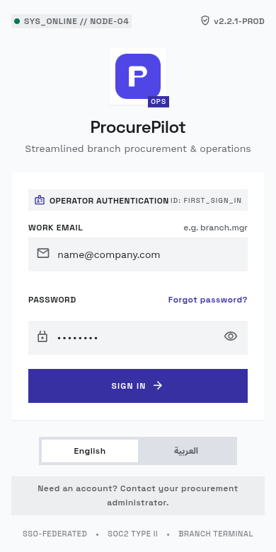

| # | Element | Description |
|---|---------|-------------|
| 1 | **App bar — brand name** | Confirms you're in the ProcurePilot app. |
| 2 | **Email Address field** | Your workspace email. Validated as non-empty and containing `@` before submitting. |
| 3 | **Password field** | Your account password. The eye icon toggles visibility. |
| 4 | **Sign In button** | Authenticates against the same Supabase-backed workspace as the web app. Shows "Signing in..." while in flight. |

**On success:** if the device supports biometric authentication (fingerprint/face), you're taken
to the biometric enrolment offer (section 4); otherwise you go straight to Home.

**On failure:** an inline error message appears above the Sign In button (invalid credentials,
rate-limited, or a generic connection error) — the form stays filled in so you can correct and
retry.

There is no "create workspace" or "forgot password" flow on mobile in this release — use the web
app for those (section 1 of the web documentation).

**Workflow:**
1. Open the app.
2. Enter the same email and password you use on web.
3. Submit the form.
4. If biometric unlock is offered, choose whether to enable it for future launches.

**Tips:**
- Use the web password-reset flow if you cannot sign in.
- If your role or workspace access recently changed, sign out and sign in again so the mobile
  app refreshes your authority.
- Mobile uses the same tenant-isolated backend as web; you do not choose a tenant manually from
  the phone.

**Business value:** mobile sign-in gives branch and approval users fast access to operational
signals without creating a separate identity model. The same workspace membership and role
boundaries apply everywhere.

**Shipped vs. mockup:** the mockup's "Forgot password?" link and EN/AR language segmented
control aren't wired up in the shipped screen — password reset and account creation stay
web-only, and language follows the device locale (section 8). The "Need an account? Contact your
procurement administrator" footer and the SSO/SOC2 badges are mockup chrome only.

---

## 4. Enable Biometric Unlock

**Shown once, immediately after a successful sign-in, only on a device that supports biometrics.**

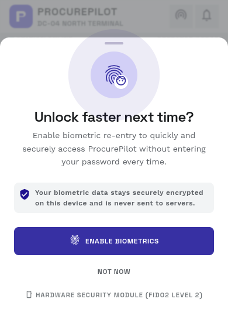

| # | Element | Description |
|---|---------|-------------|
| 1 | **Fingerprint icon + "Enable biometric unlock?"** | Explains that enabling lets you unlock the app next time with your device's fingerprint or face recognition instead of typing your password. |
| 2 | **Enable button** | Turns the preference on and proceeds to Home. |
| 3 | **Not now button** | Declines. Proceeds to Home; you're offered this again after your next credential sign-in (the preference is only ever set to "on" explicitly). |

Neither choice blocks you from reaching Home — biometric unlock is a convenience layered on top
of your stored session, never a replacement for it or a requirement to use the app.

**Workflow:**
1. Sign in with email and password.
2. When prompted, tap **Enable biometric unlock** or **Not now**.
3. Continue to Home.
4. On the next launch, a successful device biometric check unlocks the stored session.

**Tips:**
- Declining biometric unlock is reversible: sign in again later and you will be offered it
  again.
- Device-level biometric enrolment is managed by iOS or Android, not by ProcurePilot.
- If biometric unlock fails or is cancelled, the app falls back to password sign-in.

**Business value:** biometric unlock removes friction for frequent mobile checks while keeping
the user's verified workspace identity as the source of authority.

**Shipped vs. mockup:** the shipped sheet is simpler than the mockup — no branded top app bar,
no "hardware security module" footnote, and the copy is a shorter, more direct sentence.

---

## 5. App Launch (Splash / Returning-Device Unlock)

A brief loading screen shown every time the app starts, before Sign In or Home.

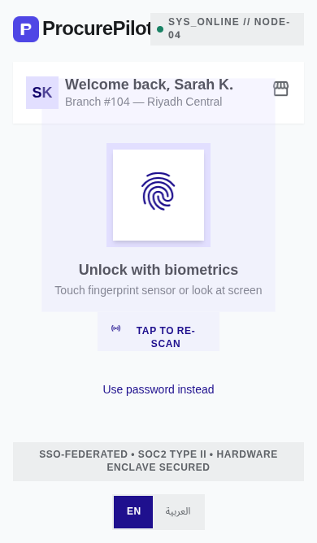

You won't normally interact with it — it decides where to send you:

1. No stored session at all -> Sign In.
2. A stored session, but biometric unlock isn't enabled -> Sign In (re-enter your password).
3. A stored session with biometric unlock enabled -> your device's biometric prompt runs
   automatically. Success refreshes your session silently and takes you to Home; a cancelled,
   failed, or unavailable biometric check falls back to Sign In rather than blocking you.

**Tips:**
- A short Splash state is normal while the app checks local session state.
- Repeated fallback to Sign In usually means biometric unlock is disabled, unavailable, or the
  stored session can no longer be refreshed.
- If your organisation removed your access, signing in again will fail with the same access
  rules enforced on web.

**Business value:** return-launch handling makes mobile quick enough for short operational
checks while still validating that the session can be trusted.

**Shipped vs. mockup:** the mockup's personalized "Welcome back, Sarah K." branch-header card,
"Use password instead" link, and EN/AR switcher aren't in the shipped screen — today it's a
plain loading indicator while the biometric check runs, with silent fallback to Sign In on
anything other than success.

---

## 6. Home

**Landing screen after sign-in or a successful biometric unlock.**

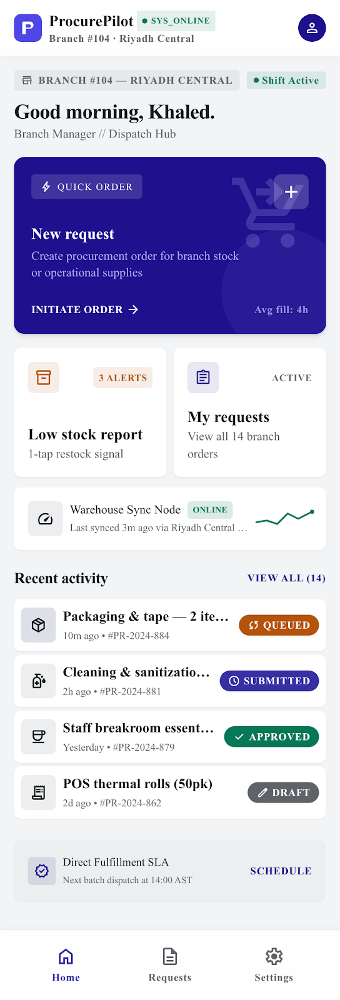
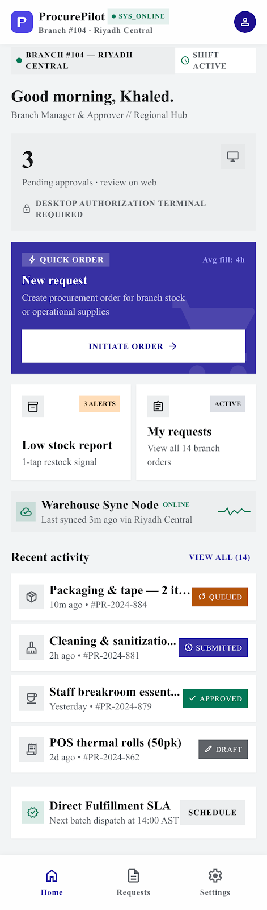

| # | Element | Description |
|---|---------|-------------|
| 1 | **App bar — "Home"** | With a sign-out icon button in the top-right corner. |
| 2 | **Your role** | Shows your workspace role (Owner, Buyer, Branch Manager, Approver, or Viewer) — the same roles as the web app (section 21 of the web documentation). |
| 3 | **Request items button** | Visible to Owner, Buyer, and Branch Manager roles. **Currently shown disabled** — a deliberate placeholder rather than a fake working flow. Request submission from mobile is a later release. |
| 4 | **Pending decisions count** | Visible only to Approver (and Owner) roles: a card reading "N request(s) awaiting your decision," loaded from the same pending-approvals list used by the web Approval Queue. Shows a spinner while loading and an inline error message if the count can't be fetched. |

**What's deliberately absent:** there is no approve, reject, or any other decision control on
this screen or anywhere else in the app — see section 12. The pending count is read-only; to act
on a request, use the web app's Approval Queue (section 18 of the web documentation).

**Workflow:**
1. Land on Home after sign-in or biometric unlock.
2. Confirm the role shown on screen matches the responsibility you expect.
3. If you are an approver or owner, check the pending-decision count.
4. Open the web app when you need to inspect, approve, reject, or create a request.

**Tips:**
- A disabled **Request items** button is expected in this release.
- A zero pending count means no request is currently routed to your mobile user's approval
  authority.
- If the count fails to load, sign out and back in, then use the web Approval Queue as the
  source of truth.

**Business value:** Home gives the user a low-friction operational signal: who they are in the
workspace and whether approvals need attention. It shortens response time without turning the
phone into an approval terminal.

**Shipped vs. mockup:** this is the biggest gap between mockup and shipped build on this page.
The shipped Home screen is just a role label, the (disabled) Request items button, and — for
approvers — a single plain count card. The mockup's bottom navigation bar (Home / Requests /
Settings), "New request" hero card, Low-stock report tile, "My requests" tile, and recent-activity
feed are all target design for later releases — see section 13. One thing the mockup gets
right, though: its approver card explicitly says pending approvals are reviewed on a "desktop
authorization terminal" — the same no-mobile-decisions constraint the shipped app enforces.

---

## 7. Sign Out

Tap the sign-out icon in the Home app bar. This:

1. Best-effort deregisters this device from push notifications (a failure here doesn't block
   sign-out — you're still signed out even if the deregistration call fails).
2. Clears the biometric-unlock preference, so the next sign-in starts fresh.
3. Clears the locally stored session and returns you to Sign In.

**Tips:**
- Sign out before sharing or retiring a device.
- After sign-out, biometric unlock must be enabled again after a successful password sign-in.
- Push deregistration is best-effort so you are not trapped in the session if the network call
  fails.

**Business value:** sign-out gives users direct control over device access and notification
registration, which matters when phones are lost, reassigned, or shared in branch operations.

---

## 8. Language

The app follows the same shared English/Arabic translation catalogue as the web app
(`packages/i18n`). Arabic renders the entire layout right-to-left. There is no in-app language
switcher yet on mobile — language currently follows the device/system locale. (The target
Settings screen previewed in section 13 adds one.)

**Tips:**
- Change the phone's system language to Arabic to review the current mobile RTL experience.
- Use the web account menu when you need an app-level language switcher today.
- Report untranslated or clipped strings; mobile uses compact layouts, so translation length
  matters.

**Business value:** bilingual support lets the same procurement process serve English and
Arabic users without separate training material or divergent workflows.

---

## 9. Roles & Permissions

Mobile uses the same workspace roles as the web app.

| Role | Mobile experience today |
|------|--------------------------|
| **Owner** | Can sign in, see role, see pending-decision count, and sign out. Decisions still happen on web. |
| **Buyer** | Can sign in, see role, see disabled request placeholder, and sign out. Buying workflows remain web-only. |
| **Branch Manager** | Can sign in, see role, see disabled request placeholder, and sign out. Mobile request creation is not shipped yet. |
| **Approver** | Can sign in, see role, see pending-decision count, and sign out. Approve/reject remains web-only. |
| **Viewer** | Can sign in, see role, and sign out. No write action is available. |

**Notes:**
- Roles are assigned and changed from web Team Management.
- Mobile does not expose admin controls, catalogue editing, supplier editing, or approval
  decisions in this release.
- Backend authorization remains the final enforcement point; hiding a mobile button is never
  the only permission control.

**Business value:** role-aware mobile access lets each user see only the operational signal
that matters to them, while preserving the accountability boundaries configured by the owner.

---

## 10. Security, Privacy, and Auditability

Mobile follows the same security model as the web app: authenticated API calls, verified
workspace membership, role-based access, and database-enforced tenant isolation.

| Area | Mobile behaviour |
|---|---|
| **Tenant isolation** | The app never asks the user to type or choose a tenant identifier. Workspace access comes from the authenticated session. |
| **Stored session** | A local session is used for return visits. Biometric unlock gates convenience access to that stored session when enabled. |
| **Push device token** | Sign-out attempts to deregister the device so future notifications are not sent to a signed-out device. |
| **Audit trail** | Mobile currently performs sign-in/session/device actions only. Commercial audit trails for quotations, matches, approvals, and savings are created by the web workflows where those actions happen. |
| **Human authority** | The mobile app never executes or authorizes purchasing decisions. Approval decisions remain a web action in this release. |

**Business value:** mobile can speed up awareness without weakening the evidence chain. The
commercial actions that affect recommendations, approvals, and savings remain auditable in the
web product.

---

## 11. FAQ

**Q: Why can't I submit a purchase request from my phone?**
A: That flow hasn't shipped yet. For now, create and submit requests from the web app
(sections 16–17 of the web documentation); the mobile app will grow this capability in a later
release. The "Request items" button on Home is a visible placeholder, not a bug.

**Q: I'm an approver — why can't I approve or reject from my phone?**
A: This is an intentional constraint, not a gap: ProcurePilot never allows autonomous or
mobile-only purchasing decisions in this release. The Home screen shows you *how many* requests
are waiting, so you know to go make the decision on the web app's Approval Queue.

**Q: Do I need to sign in every time I open the app?**
A: Only if you haven't enabled biometric unlock, or your device doesn't support it. Otherwise, a
fingerprint or face check unlocks your existing session.

**Q: What happens if I decline biometric unlock?**
A: Nothing is lost — you're taken to Home immediately, and you can still use the app normally
with password sign-in each time. You'll see the offer again after your next credential sign-in.

**Q: The screenshots show a "New request" screen, a requests list, and a Settings tab — where
are those in my app?**
A: Not shipped yet. Those images are design mockups for upcoming releases, shown for reference in
section 13 — the current app is Sign In, biometric unlock, and Home only.

**Q: Why does mobile show only a pending approval count instead of the full approval queue?**
A: The count is a prompt to act, not the decision surface. The full queue on web shows branch,
cost centre, budget impact, line details, and the approve/reject dialog needed for an auditable
decision.

**Q: Can mobile see product, supplier, quotation, matching, compare, or savings pages?**
A: Not in this release. Those are web-only because they require denser tables, source evidence,
comparison data, and audit context.

**Q: Is biometric unlock mandatory?**
A: No. It is optional and can always fall back to password sign-in.

**Q: Does signing out also stop notifications?**
A: The app attempts to deregister the device's push token during sign-out. If the network call
fails, sign-out still completes so the user is not kept in a local session.

---

## 12. Known Limitations

| # | Area | Limitation |
|---|------|-----------|
| 1 | Home | "Request items" is a disabled placeholder — no request-submission flow exists on mobile yet. |
| 2 | Home / Approvals | No approve/reject control exists anywhere in the app, by design (see the FAQ above) — only a read-only pending count for approvers. |
| 3 | Navigation | No bottom navigation, requests list, or Settings screen exists yet — Home is the only screen after sign-in. |
| 4 | Language | No in-app language switcher; the app follows the device locale. |
| 5 | Sessions | If a session is revoked server-side, the mobile client's own refresh-token exchange happens directly against Supabase Auth rather than through ProcurePilot's API — this path has a documented gap in test coverage, not a confirmed bug (see the engineering notes in `apps/api/tests/integration/test_session_revocation.py`). |
| 6 | Documentation images | Mobile screenshots are design mockups, not simulator captures. The shipped-vs-mockup notes under each section are the source of truth for current behaviour. |
| 7 | Commercial modules | Catalogue, suppliers, import, quotations, matching, compare, basket split, alerts, savings, team management, and organisation settings are web-only today. |

If you hit anything beyond this list, flag it to the product team.

---

## 13. Design Preview — Coming in Later Releases

**None of the screens in this section exist in the app yet.** They're shown here as design
mockups from the Stitch design system so you know what's coming and can plan around it — treat
every image below as a target design, not a feature you can use today.

### New Request

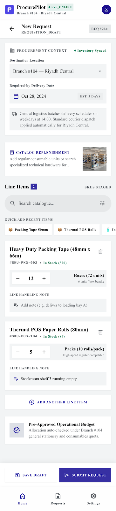

Mobile-native request submission: destination branch, required-by date, a product search/catalogue
picker, quantity steppers per line, and a budget pre-check before submitting. This is the mobile
equivalent of the web app's New Purchase Request screen (section 17 of the web documentation).

**Expected workflow:** choose branch, add product lines and quantities, review budget status,
then submit for approval when online.

**Business value:** request creation on mobile would capture demand at the branch before it
becomes a chat message or verbal request, improving visibility by location and need date.

### My Requests

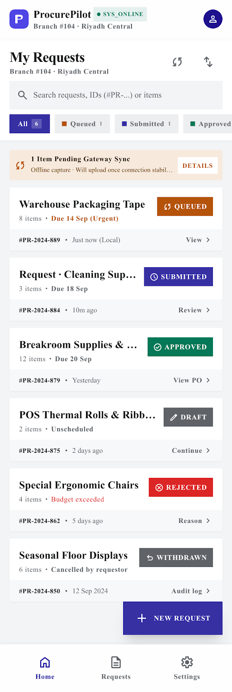
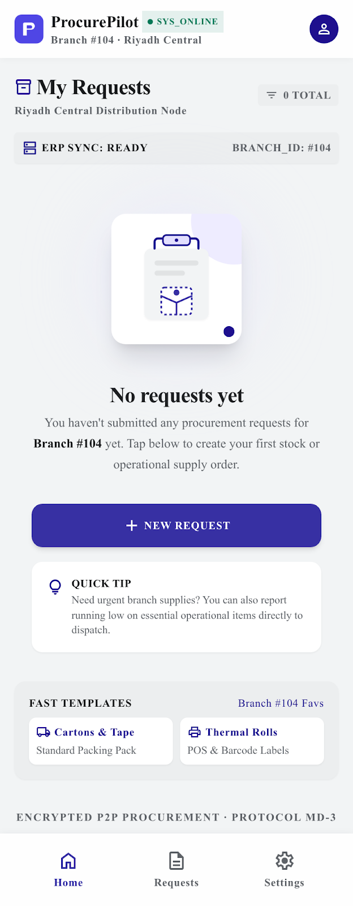

A requester's own request history on mobile, with status filters (Draft, Submitted, Approved,
Rejected, Withdrawn, and an offline "Queued" state for drafts captured without connectivity) and
an empty state guiding a first-time user to create a request.

**Expected workflow:** review your own drafts and submitted requests, open a detail page, and
track whether procurement has approved, rejected, or withdrawn the request.

**Business value:** request history closes the loop for branch users. They can see what
happened without asking procurement for manual status updates.

### Request Detail & Decision

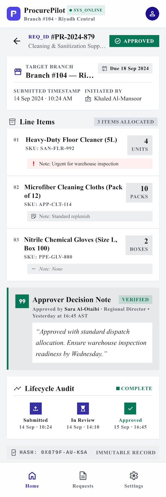

A read-only, requester-facing view of a decided request: line items, the approver's decision
comment, and a lifecycle timeline (Submitted → In Review → Approved/Rejected). This mirrors the
Approval section already shown on the web request detail view (section 17 of the web
documentation) — it does not add any approve/reject control on mobile.

**Expected workflow:** open a request from My Requests, inspect lines, read the approver's
decision/comment, and follow the lifecycle timeline.

**Business value:** detail visibility makes approvals transparent to requesters while keeping
decision authority on web.

### Low-Stock Report

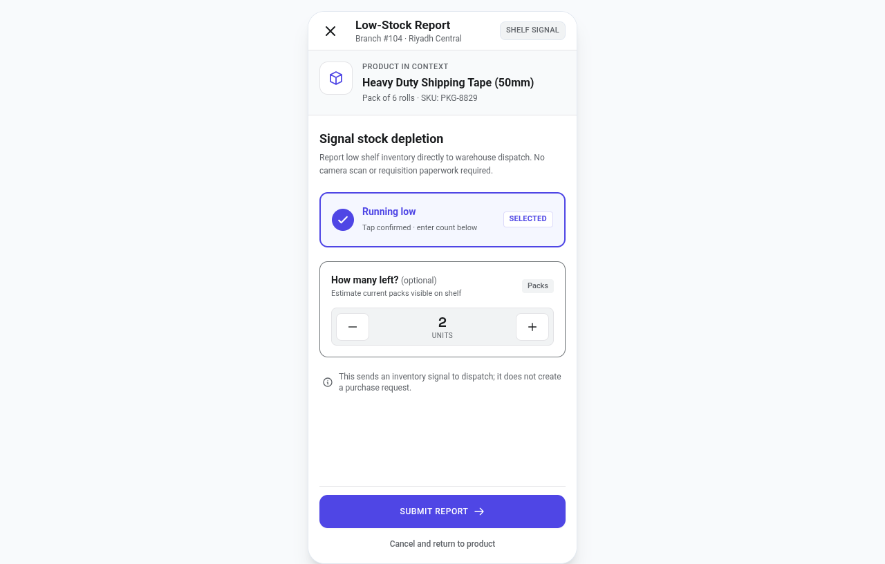
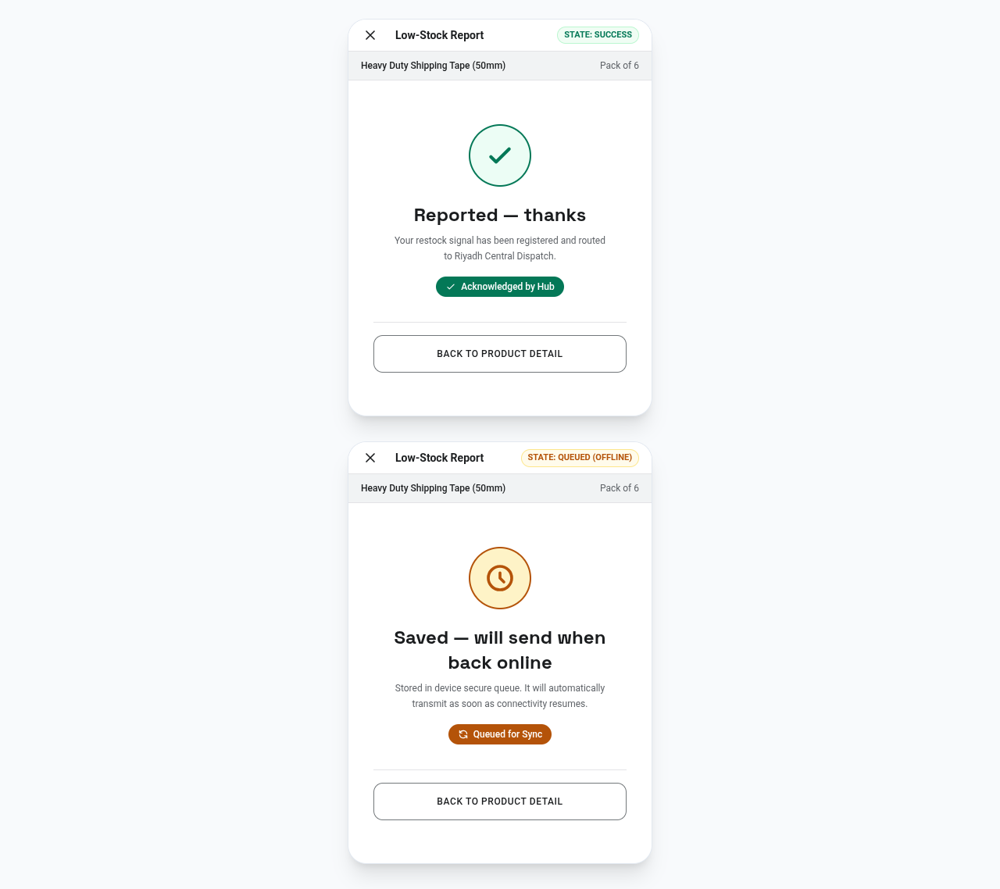

A lightweight "shelf is running low" signal a branch user can send straight to dispatch — no
photo, no requisition paperwork, distinct from submitting a full purchase request. Note the
"Queued (offline)" state: like the rest of the mobile app's offline-tolerant design, a report
made without connectivity is stored locally and sent automatically once the device is back
online. The backend schema for this (`low_stock_report`) already exists (shipped as part of the
R2.2 mobile schema); only the mobile screen itself is still to come.

**Expected workflow:** select a branch/product, enter the low-stock signal, submit immediately
or queue offline, and let procurement review the signal later.

**Business value:** low-stock reporting is a lightweight early-warning path. It can reduce
emergency buying without turning every shelf observation into a full purchase request.

### Settings

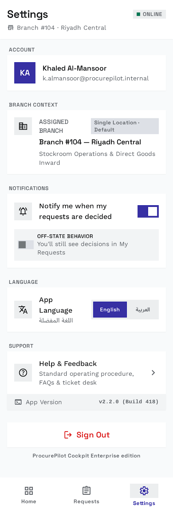

A dedicated Settings screen: account info, assigned branch, a notification toggle, an in-app
language switcher, help/feedback, app version, and sign-out. Today, the only settings-like
control in the app is the sign-out icon in the Home app bar (section 7); language follows the
device locale (section 8).

**Expected workflow:** review account details, adjust notifications and language, reach help,
and sign out from one predictable place.

**Business value:** a mobile Settings screen would make device-specific preferences visible
without pushing users back to the web app for small account tasks.

---

## Getting Help

- Use the web app's feedback path when available: **Account menu -> Send Feedback**.
- Email: support@procurepilot.example.com.
- Response target: within 1 business day for paid plans.
