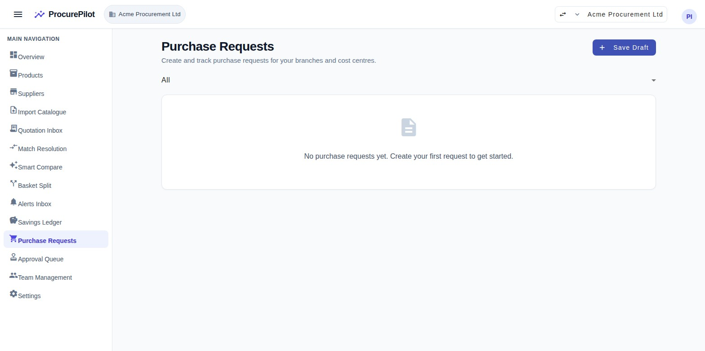

# ProcurePilot User Documentation

> Complete system journey with annotated screenshots for every screen.
> Last updated: 31 Aug 2026.

---

## Table of Contents

1. [Sign In](#1-sign-in)
2. [Dashboard](#2-dashboard)
3. [Product Catalogue](#3-product-catalogue)
4. [Create / Edit Product](#4-create--edit-product)
5. [Suppliers](#5-suppliers)
6. [Import Wizard](#6-import-wizard)
7. [Quotation Review Queue](#7-quotation-review-queue)
8. [Upload Supplier Quotation](#8-upload-supplier-quotation)
9. [Quotation Review & Authorization](#9-quotation-review--authorization)
10. [Match Resolution Queue](#10-match-resolution-queue)
11. [Smart Compare](#11-smart-compare)
12. [Basket Split Optimiser](#12-basket-split-optimiser)
13. [Alerts Inbox](#13-alerts-inbox)
14. [Savings Ledger](#14-savings-ledger)
15. [Export Savings](#15-export-savings)
16. [Purchase Requests](#16-purchase-requests)
17. [New Purchase Request](#17-new-purchase-request)
18. [Approval Queue](#18-approval-queue)
19. [Team Management](#19-team-management)
20. [Organisation Settings](#20-organisation-settings)
21. [Roles & Permissions](#21-roles--permissions)
22. [FAQ](#22-faq)

---

## 1. Sign In

**Route:** `/auth/sign-in`

| # | Element | Description |
|---|---------|-------------|
| 1 | **ProcurePilot logo** | Brand identity — confirms you are on the correct application. |
| 2 | **Email Address field** | Enter the work email associated with your workspace account. |
| 3 | **Forgot password? link** | Opens the password-reset flow. You will receive a reset email. |
| 4 | **Password field** | Enter your account password. The eye icon toggles visibility. |
| 5 | **Sign In button** | Authenticates your session and redirects to the Dashboard. |
| 6 | **Create workspace link** | If you have a platform invitation token, this starts the sign-up flow to create a new business workspace. |

**Tips:**
- ProcurePilot supports English and Arabic. Language can be changed after sign-in from the account menu.
- If you receive an "Invalid email or password" error, check your email address for typos or use **Forgot password?** to reset.

---

## 2. Dashboard

**Route:** `/home`

| # | Element | Description |
|---|---------|-------------|
| 1 | **Top bar** | Shows the ProcurePilot brand, your active workspace name, and the account menu (workspace switcher, language toggle, sign out). |
| 2 | **Side navigation** | Lists all available modules: Overview, Products, Suppliers, Import Catalogue, Quotation Inbox, Match Resolution, Smart Compare, Basket Split, Alerts Inbox, Savings Ledger, Purchase Requests, Approval Queue, Team Management, Settings. The active page is highlighted. |
| 3 | **Welcome banner** | Displays your workspace name and confirms your workspace is provisioned with database-level tenant isolation and role-based access control. |
| 4 | **Tenant & Security card** | Shows your Tenant ID, workspace slug, and the isolation level (PostgreSQL Row-Level Security, FORCED). This is read-only and confirms your data is fully isolated. |
| 5 | **Regional & Financial Settings card** | Displays your region (e.g. GB), primary currency (e.g. GBP), tax model (e.g. uk_vat_standard), and default locale. These are set at sign-up and are immutable. |
| 6 | **Current User Authority card** | Shows your email, assigned role (Owner, Buyer, etc.), and MFA status. |
| 7 | **Procurement Intelligence Modules** | A roadmap of available modules. "Active" modules are ready to use; "Upcoming" modules are planned for future releases. |

---

## 3. Product Catalogue

**Route:** `/products`

| # | Element | Description |
|---|---------|-------------|
| 1 | **Page title — "Product Master"** | The master list of all products in your workspace. Products are the items you purchase and compare across suppliers. |
| 2 | **Import Products button** | Opens the Import Wizard to bulk-upload products from a CSV file. |
| 3 | **+ New Product button** | Opens the product creation form to add a single product manually. |
| 4 | **Search bar** | Type to filter products by name. The search is instant and case-insensitive. |
| 5 | **Status filter dropdown** | Filter by Active, Archived, or All products. Archived products are hidden from comparison and request flows. |
| 6 | **Product table** | Lists all products with columns for name, brand, variant, GTIN, base unit, normalised quantity, preferred supplier, and status. Click a row to edit the product. |
| 7 | **Empty state** | When no products exist, a prompt guides you to add your first product. |

**Workflow:**
1. Start by importing your existing product list via CSV, or add products one by one.
2. Each product needs at minimum a **name** and a **base measurement unit** (kg, litre, piece, etc.).
3. Products can be archived (soft-deleted) — they are never hard-deleted.

---

## 4. Create / Edit Product

**Route:** `/products/new` or `/products/:id`

| # | Element | Description |
|---|---------|-------------|
| 1 | **Product Name** (required) | The primary display name for this product across the system. |
| 2 | **Brand** | The manufacturer or brand. Used as a matching signal when AI resolves extracted quotation lines. |
| 3 | **Variant** | Size, colour, flavour, or other distinguishing detail. |
| 4 | **GTIN / Barcode** | The Global Trade Item Number (EAN/UPC). When present, this is the strongest matching signal for quotation extraction. |
| 5 | **Base Measurement Unit** (required) | The unit used for price normalisation — kg, litre, piece, metre, etc. All suppliers' prices are normalised to this unit so you can compare like-for-like. |
| 6 | **Canonical Name** | An optional standardised name. If left blank, it defaults to the product name. |
| 7 | **Pack Definition & Normalisation** | Define how this product is packaged. **Pack Count** (e.g. 6) times **Unit Size** (e.g. 500ml) equals the **Normalised Base Quantity**, which is calculated automatically. |
| 8 | **Preferred Supplier** | Optionally assign a default supplier for this product. |

**Key concept — Pack Normalisation:**
A supplier may quote "1 case of 12 x 500ml bottles" while another quotes "1 pack of 6 x 1L bottles." ProcurePilot normalises both to a per-litre price so you see the true cost comparison.

---

## 5. Suppliers

**Route:** `/suppliers`

| # | Element | Description |
|---|---------|-------------|
| 1 | **Page title — "Suppliers"** | The master list of all suppliers in your workspace. |
| 2 | **Import Suppliers button** | Bulk-import suppliers from a CSV via the Import Wizard. |
| 3 | **+ New Supplier button** | Opens the supplier creation form. |
| 4 | **Status filter** | Filter by Active, Preferred, Blocked, Archived, or All. Blocked suppliers trigger a policy flag if their offers appear in Smart Compare. |
| 5 | **Supplier table** | Lists all suppliers with columns for name, status, payment terms, lead time, minimum order value, and delivery fee. Click a row to edit. |

**Supplier statuses:**
- **Active** — available for quotations and purchasing.
- **Preferred** — prioritised in recommendations.
- **Blocked** — offers from this supplier are flagged in Smart Compare; purchasing requires an exception.
- **Archived** — hidden from active workflows.

---

## 6. Import Wizard

**Route:** `/import`

| # | Element | Description |
|---|---------|-------------|
| 1 | **Step indicator** | Three-step wizard: 1. Upload File → 2. Validate & Preview → 3. Confirmation. |
| 2 | **Import type selector** | Choose whether to import a **Products Catalogue** or a **Suppliers List**. |
| 3 | **Download Template button** | Downloads a CSV file pre-filled with the correct column headers for the selected import type. Use this to prepare your data in the right format before uploading. |
| 4 | **Drag-and-drop zone** | Drag a CSV file here or click to browse. Accepts comma-delimited `.csv` files with a header row. |
| 5 | **Safety notice** | "No data is saved during validation" — you will preview and confirm before any records are created. |
| 6 | **Upload & Validate File button** | Uploads the file, parses it, and shows a preview with validation results. Duplicates can be handled with "skip" or "update" policies. |

**Tips:**
- Click **Download Template** to get a CSV with the correct column headers. Fill in your data and upload.
- The wizard detects duplicates by GTIN (products) or name (suppliers) and lets you choose to skip or update existing records.

---

## 7. Quotation Review Queue

**Route:** `/quotations`

| # | Element | Description |
|---|---------|-------------|
| 1 | **Page title — "Quotation Review Queue"** | Lists all quotations that have been extracted and need human review before they become trusted commercial data. |
| 2 | **Upload Quotation button** | Opens the upload screen to add a new supplier quotation. |
| 3 | **Filter by Status** | Filter queue by Open, Confirmed, or All status. |
| 4 | **Filter by Priority** | Filter by priority level (High, Medium, Low, or All). Priority is set based on extraction confidence. |
| 5 | **Review task table** | Each row shows the quotation, supplier, date, line count, confidence score, priority, and status. Click a row to open the detailed review screen. |
| 6 | **Empty state** | When no review tasks are pending, this confirms all quotations have been reviewed. |

---

## 8. Upload Supplier Quotation

**Route:** `/quotations/upload`

| # | Element | Description |
|---|---------|-------------|
| 1 | **Page title — "Upload Supplier Quotation"** | Upload a document to start the AI extraction process. |
| 2 | **Back to Review Queue link** | Returns to the quotation review queue without uploading. |
| 3 | **Drag-and-drop zone** | Drag a quotation file here or click **Choose File** to browse. |
| 4 | **Supported formats** | PDF, PNG, JPEG, TIFF, CSV, XLS, XLSX — up to 25 MB. |
| 5 | **Security notice** | "Documents are uploaded securely and directly to encrypted storage." |
| 6 | **Try with a sample quotation** | Download a pre-built sample quotation to test the extraction pipeline without needing a real supplier document. Three samples are available: "Acme Foods" (5 items, CSV), "Fresh Direct" (6 items, CSV), and "Al-Faisal Trading" (6 items, PDF). |

**After upload:**
1. The file is uploaded via a presigned URL directly to encrypted storage.
2. An extraction job starts automatically (usually under 45 seconds per page).
3. A progress indicator shows the extraction state (uploading → processing → extracted).
4. When complete, a **"Go to Review"** button appears to inspect the extracted data.

---

## 9. Quotation Review & Authorization

**Route:** `/quotations/:id/review`

After AI extraction finishes, each quotation lands in the review queue. Open a review task to inspect, correct, and authorize the extracted data before it feeds into matching and comparison.

| # | Element | Description |
|---|---------|-------------|
| 1 | **Arithmetic discrepancy banner** | Amber warning when the AI-stated total does not match the sum of extracted line totals. Shows both figures so the reviewer can decide which is correct. |
| 2 | **Attention-required navigation** | Chips highlighting fields with low confidence scores (below 85 %) or extraction warnings. Click a chip to jump directly to the flagged field. |
| 3 | **Source document evidence panel** | The original uploaded document displayed alongside the extraction results. Bounding-box highlights link each extracted value back to where the AI read it in the source. |
| 4 | **Download original document** | Button in the document panel header. Opens the original uploaded file (PDF, image, or spreadsheet) in a new browser tab via a time-limited secure URL. |
| 5 | **Quotation details form** | Editable header fields: supplier name, currency, issue date, expiry date, and stated total. Each field shows its confidence score; scores below threshold are highlighted for review. |
| 6 | **Extracted line items table** | One row per line extracted by the AI. Columns: line text, quantity, pack count, unit size, pack unit, unit price, discount, and line total. Low-confidence cells are flagged. |
| 7 | **Field provenance tooltip** | Hover any extracted value to see the extraction method, model version, page number, and confidence score. |
| 8 | **Save Corrections** | Persist manual edits without changing the quotation's status — the reviewer can return later. |
| 9 | **Confirm & Authorize** | Mark the quotation as verified and release it into the matching pipeline. This action is irreversible; the quotation moves from *needs_review* to *accepted*. |

**Review workflow:**
1. Open a task from the review queue (section 7).
2. Check the arithmetic discrepancy banner — if present, compare stated total against the line sum.
3. Walk through attention-required chips to inspect flagged fields against the source document.
4. Correct any extraction errors inline and click **Save Corrections**.
5. When satisfied, click **Confirm & Authorize** to release the quotation for matching.

---

## 10. Match Resolution Queue

**Route:** `/matching`

| # | Element | Description |
|---|---------|-------------|
| 1 | **Page title — "Match Resolution Queue"** | Lists quotation lines that need human resolution: confirming which catalogue product each extracted line refers to. |
| 2 | **Status filter** | Filter by Open (awaiting resolution), Resolved, or All. |
| 3 | **Priority filter** | Filter by priority level assigned based on confidence. |
| 4 | **Routing Reason filter** | Filter by why the line was routed to the queue: no match, low confidence, multiple candidates, etc. |
| 5 | **Match task table** | Each row shows the extracted product name, quotation, number of match candidates, confidence, and status. Click to open the resolution screen. |

**In the resolution screen (not shown — opened from a task row):**
- The left panel shows the extracted quotation line details (quantity, pack, unit price, VAT, delivery fee, discount).
- Candidate cards show each potential product match with confidence scores and matching signals (alias hit, GTIN match, lexical/semantic similarity, brand, variant, pack unit, pack size, price).
- You select an outcome: **Same product**, **Different pack**, **Different variant**, **Compatible alternative**, or **No match — create new product**.
- Keyboard shortcuts: 1–9 select a candidate, arrows navigate, O toggles outcome, Enter confirms.

---

## 11. Smart Compare

**Route:** `/offers/compare`

| # | Element | Description |
|---|---------|-------------|
| 1 | **Page title — "Smart Compare"** | Compare supplier offers side-by-side with true landed cost and evidence-backed AI recommendations. |
| 2 | **Product selector** | Select a product from your catalogue to see all available supplier offers. |
| 3 | **Required Quantity field** | Enter the quantity you need. Prices recalculate live in under 150ms — tiers, minimum order values, and delivery thresholds update instantly. |
| 4 | **Include expired offers toggle** | Check to include expired quotation offers in the comparison. |
| 5 | **Comparison grid** (shown when a product with offers is selected) | Each row is one supplier offer. Columns: supplier, normalised unit price, landed cost, lead time, reliability, stock signal, match confidence, validity, status. |
| 6 | **AI recommendation banner** (shown with data) | Displays the recommended action with confidence score, winning margin, risk notes, validity window, tie-break notes, and evidence weights breakdown. |
| 7 | **Record Purchase action** | From any offer row, click "Record Purchase" to record the outcome and have the savings automatically calculated. |

**Related screens:**
- **Product Intelligence** (`/offers/product-intelligence`) — price history view with metrics cards (last paid, average paid, best price), price history chart, and historical records table.
- **Basket Split** — see next section.

---

## 12. Basket Split Optimiser

**Route:** `/offers/basket-split`

| # | Element | Description |
|---|---------|-------------|
| 1 | **Page title — "Two-Supplier Basket Split"** | Optimise purchasing across exactly two suppliers for minimum total landed cost using a constraint-programming solver (OR-Tools CP-SAT). |
| 2 | **First Supplier selector** | Select the first supplier. The two selectors enforce mutual exclusion — you cannot pick the same supplier twice. |
| 3 | **Second Supplier selector** | Select the second supplier. |
| 4 | **Basket Items section** | Add the products and quantities you want to purchase. Click **+ Add Item** to add more lines. |
| 5 | **Product selector** (per line) | Select a product from your catalogue. |
| 6 | **Quantity field** (per line) | Enter the required quantity. |
| 7 | **Optimise Basket Split button** | Submits the basket to the solver. The job runs asynchronously with a progress indicator. |

**Results (after optimisation):**
- **Feasible result:** Per-supplier allocation cards showing which products go to which supplier, quantities, costs, total landed cost, and savings compared to single-supplier baseline.
- **Infeasible result:** Shows which products are missing from which supplier.
- **Failed result:** System error details.

---

## 13. Alerts Inbox

**Route:** `/alerts`

| # | Element | Description |
|---|---------|-------------|
| 1 | **Page title — "Actionable Alerts Inbox"** | Proactive commercial signals computed live from your current quotations and price history. |
| 2 | **Filter by Alert Type** | Filter by type: Price Expiring, Supplier Disappeared, Price Swing, or All Alert Types. |
| 3 | **Alert list** | Each alert shows severity (info/warning/critical), kind, affected product/supplier, and a description. Click to see evidence details. |
| 4 | **All clear state** | When no active alerts exist, a green checkmark confirms "No commercial conditions requiring immediate attention." |

**Alert types:**
- **Price Expiring** — a quotation is about to expire and no renewal has been uploaded.
- **Supplier Disappeared** — a supplier that previously quoted for a product has not submitted a quotation in the current cycle.
- **Price Swing** — a significant price change (up or down) compared to the previous quotation for the same product/supplier.

---

## 14. Savings Ledger

**Route:** `/savings`

| # | Element | Description |
|---|---------|-------------|
| 1 | **Page title — "Savings Ledger"** | Defensible record of procurement savings calculated against verified historical baselines. |
| 2 | **Export Savings button** | Opens the export screen to generate an audit-ready Excel or PDF report. |
| 3 | **+ Record Purchase Outcome button** | Opens the outcome capture form to record a purchase and automatically calculate savings. |
| 4 | **Stats cards** | Three summary cards: **Total Verified Savings** (currency amount), **Verified Outcomes** (count), **Pending Outcomes** (count). |
| 5 | **Filters** | Filter by status (All/Verified/Pending), supplier, and date range (start/end pickers). **Clear Filters** resets all. |
| 6 | **Savings table** | Each row: product, supplier, baseline value, actual value, delta (colour-coded green for savings / red for overspend), status (verified/pending with icons), recorded date. Click **"View Evidence"** to drill down. |
| 7 | **Empty state with CTA** | When no savings exist, a prompt with **"+ Record First Purchase"** guides you to the outcome capture form. |

**Key concept — Verified Savings:**
- Every recorded purchase creates a **SavingRecord** by comparing the actual price paid against a baseline policy (e.g. last paid price, average paid, best available offer).
- Verified savings are **immutable** — once verified, they cannot be edited or deleted. If a correction is needed, a new adjustment record is created.
- The evidence chain traces from quotation → match → offer → purchase → saving, providing full auditability.

---

## 15. Export Savings

**Route:** `/savings/export`

| # | Element | Description |
|---|---------|-------------|
| 1 | **Page title — "Export Savings Ledger"** | Generate audit-ready reports of verified savings. |
| 2 | **Compliance notice** | "Only verified savings are included in the export. Pending rows are excluded per audit compliance rules." |
| 3 | **Export Format selector** | Choose **Excel Spreadsheet (.xlsx)** or **PDF Summary Report (.pdf)**. |
| 4 | **Period Start Date** | Filter savings from this date. |
| 5 | **Period End Date** | Filter savings up to this date. |
| 6 | **Filter by Supplier** | Optionally restrict the export to a specific supplier. |
| 7 | **Cancel button** | Returns to the Savings Ledger without generating an export. |
| 8 | **Generate Export button** | Submits the export job. A progress bar shows processing status, and a download link appears when complete. |

---

## 16. Purchase Requests

**Route:** `/requests`

| # | Element | Description |
|---|---------|-------------|
| 1 | **Page title — "Purchase Requests"** | Create and track purchase requests for your branches and cost centres. |
| 2 | **+ Save Draft button** | Opens the new purchase request form. |
| 3 | **Status filter** | Filter by All, Draft, Submitted, Approved, Rejected, or Withdrawn. |
| 4 | **Request table** | Each row shows the request number, branch, cost centre, required-by date, estimated total, budget status, status chip (colour-coded), and actions. |
| 5 | **Empty state** | When no requests exist, a prompt guides you to create your first request. |

**Request lifecycle:**
1. **Draft** — a request is created and can be freely edited. Lines can be added/removed.
2. **Submitted** — the request is sent for approval. It can no longer be edited, but can be withdrawn.
3. **Approved / Rejected** — decided by an approver. Cannot be withdrawn after a decision.
4. **Withdrawn** — the requester pulled back a draft or submitted request before a decision.

---

## 17. New Purchase Request

**Route:** `/requests/new`

| # | Element | Description |
|---|---------|-------------|
| 1 | **Page title — "New Purchase Request"** | Create a purchase request for a specific branch. |
| 2 | **Branch selector** (required) | Select the branch this request is for. Branches are defined in Organisation Settings. |
| 3 | **Cost Centre selector** (optional) | Optionally assign the request to a cost centre for budget tracking. |
| 4 | **Required By date** (required) | The date by which the goods are needed. |
| 5 | **Line Items section** | Each line needs a **Product** (from your catalogue), a **Quantity**, and an optional **Note**. |
| 6 | **+ Add Line button** | Adds another line item row. At least one line is required to submit. |
| 7 | **Remove line button** (red X) | Removes a line item from the request. |
| 8 | **Cancel button** | Returns to the requests list without saving. |
| 9 | **Save Draft button** | Saves the request as a draft. You can return to edit it later. |

**After saving a draft:**
- The page shows the saved request with a **Submit** button to send it for approval.
- Estimated unit prices are computed from landed cost data and displayed per line.
- An estimated total with budget status is shown.

---

## 18. Approval Queue

**Route:** `/approvals`

| # | Element | Description |
|---|---------|-------------|
| 1 | **Page title — "Approval Queue"** | Requests awaiting your decision. Only requests routed to you (based on approval thresholds and delegation rules) appear here. |
| 2 | **Request cards** (shown when requests are pending) | Each card shows the request details: requester, branch, cost centre, estimated total, budget impact, line items, and recommended supplier. |
| 3 | **Approve / Reject / Request Change actions** (on each card) | Approve the request, reject it with a reason, or request changes from the requester. |

**Note:** The Approval Queue is part of Phase 2 (Requests & Approvals) and is currently being built. Threshold-based routing and delegation are in progress.

---

## 19. Team Management

**Route:** `/team` (Owner only)

| # | Element | Description |
|---|---------|-------------|
| 1 | **Page title — "Team Management"** | Manage workspace members, invite colleagues, and configure role-based access. |
| 2 | **Invite Member button** | Opens a dialog to invite a colleague by email. You assign them a role (Owner, Buyer, Branch Manager, Approver, Viewer) at invitation time. |
| 3 | **Members tab** | Lists all current members with columns: email/avatar, role (colour-coded pill), status (Active/Removed), MFA status, join date, and actions menu. |
| 4 | **Pending Invitations tab** | Lists all sent invitations with email, assigned role, status (Pending/Accepted/Revoked/Expired), expiry date, and revoke action. |
| 5 | **Actions menu** (per member) | Options: Change Role, Remove Member. The workspace owner cannot be removed. |

**Invitation flow:**
1. Click **Invite Member** → enter email and select role → send.
2. The invitee receives an email with a link to accept the invitation.
3. They can create a new account or sign in with an existing one.
4. Once accepted, they appear in the Members tab with their assigned role.

---

## 20. Organisation Settings

**Route:** `/settings`

| # | Element | Description |
|---|---------|-------------|
| 1 | **Page title — "Organisation Settings"** | Manage your organisation's branches, cost centres, and budgets in one place. |
| 2 | **Branches section** | Define your physical locations or operational divisions. Click **+ New Branch** to add one. Each branch has a name and can be activated/deactivated. Deactivating a branch with dependents (requests, members assigned to it) shows a confirmation dialog. |
| 3 | **Cost Centres section** | Define cost centres for budget tracking. Click **+ New Cost Centre** to add one. Cost centres can be archived. |
| 4 | **Budgets section** | Define budgets linked to branches and/or cost centres. Click **+ Define Budget** to create one. Budgets have a period (start/end dates) and an amount in your workspace currency. |

**Why this matters:**
- Purchase requests require a **branch** — this determines who can see and approve the request.
- Cost centres and budgets enable budget-impact visibility on purchase requests.
- When a request's estimated total would exceed a budget, a warning is shown.

---

## 21. Roles & Permissions

| Role | Description | Key capabilities |
|------|-------------|-----------------|
| **Owner** | Full administrative access. | Manage billing, team, settings; all buyer capabilities. |
| **Buyer** | Day-to-day procurement operator. | Upload quotations, compare offers, record purchases, manage catalogue, create requests. |
| **Branch Manager** | Location-level requestor. | Create purchase requests, confirm deliveries. |
| **Approver** | Decision authority. | Approve or reject purchase requests within assigned thresholds. |
| **Viewer** | Read-only access. | View dashboards, reports, and savings data. Cannot modify any data. |

**Notes:**
- Roles are assigned at invitation time and can be changed by the Owner from Team Management.
- Role-based visibility is enforced in the navigation — menu items are hidden for unauthorised roles.
- Some actions are gated by role: Import, Upload Quotation, Record Purchase, Team Management, and Settings are restricted to authorised roles.

---

## 22. FAQ

**Q: Can I edit a verified saving?**
A: No. Verified savings are immutable. If a correction is needed, a new adjustment record is created.

**Q: Why is extraction confidence low?**
A: Usually because the document is blurry, handwritten, or uses an unfamiliar layout. Your corrections improve future extraction accuracy.

**Q: What happens if a supplier is blocked?**
A: Smart Compare flags offers from blocked suppliers, and purchasing requires an exception justification.

**Q: Can I use ProcurePilot in Arabic?**
A: Yes. Click the account menu (top right) and select "Arabic". The entire layout switches to RTL automatically, including navigation, forms, and data tables.

**Q: What file formats can I upload for quotation extraction?**
A: PDF, PNG, JPEG, TIFF, CSV, XLS, and XLSX — up to 25 MB per file.

**Q: How does pack normalisation work?**
A: Each product has a base unit (kg, litre, piece, etc.). When you define the pack count and unit size, ProcurePilot calculates the normalised base quantity. All supplier prices are converted to this normalised unit for true like-for-like comparison.

**Q: Can I switch between multiple workspaces?**
A: Yes. If you belong to multiple workspaces, use the workspace switcher in the top bar to switch. Each workspace has its own data, members, and settings — completely isolated.

**Q: Who can approve purchase requests?**
A: Users with the Approver or Owner role. Approval routing is based on configurable thresholds — requests above a certain amount may require a higher-level approver.

---

## Getting Help

- In-app feedback: **Account menu → Send Feedback**.
- Email: support@procurepilot.example.com.
- Response target: within 1 business day for paid plans.
