# ProcurePilot User Documentation

> Complete system journey with annotated screenshots for every screen.
> Last updated: 26 Sep 2026.
>
> Covers the web app only. For the mobile app (sign-in, biometric unlock, role-aware home
> screen), see [ProcurePilot Mobile App User Documentation](mobile-app-user-documentation.md).

---

## Table of Contents

1. [Sign In](#1-sign-in)
2. [Dashboard](#2-dashboard)
3. [Product Catalogue](#3-product-catalogue)
4. [Create / Edit Product](#4-create--edit-product)
5. [Suppliers](#5-suppliers)
6. [Import Wizard](#6-import-wizard)
7. [Quotation Review Queue](#7-quotation-review-queue)
8. [Upload Supplier Quotation](#8-upload-supplier-quotation)
9. [Quotation Review & Authorization](#9-quotation-review--authorization)
10. [Match Resolution Queue](#10-match-resolution-queue)
11. [Smart Compare](#11-smart-compare)
12. [Basket Split & Advanced Optimiser](#12-basket-split--advanced-optimiser)
13. [Supplier Scorecards & Supplier IQ](#13-supplier-scorecards--supplier-iq)
14. [Alerts Inbox & Anomaly Detection](#14-alerts-inbox--anomaly-detection)
15. [Savings Ledger](#15-savings-ledger)
16. [Export Savings](#16-export-savings)
17. [Purchase Requests](#17-purchase-requests)
18. [New Purchase Request](#18-new-purchase-request)
19. [Approval Queue](#19-approval-queue)
20. [Team Management](#20-team-management)
21. [Organisation Settings](#21-organisation-settings)
22. [Reports Center](#22-reports-center)
23. [Report Schedules & Schedule Form](#23-report-schedules--schedule-form)
24. [Weekly Digest & Digest Settings](#24-weekly-digest--digest-settings)
25. [Roles & Permissions](#25-roles--permissions)
26. [Ingestion Dashboard](#26-ingestion-dashboard)
27. [Email Forwarding Setup](#27-email-forwarding-setup)
28. [Email Ingestion Log](#28-email-ingestion-log)
29. [Capture a Quotation (Photo or Upload)](#29-capture-a-quotation-photo-or-upload)
30. [Catalogue Import (Bulk Price List)](#30-catalogue-import-bulk-price-list)
31. [Reorder Forecasts & Reorder Queue](#31-reorder-forecasts--reorder-queue)
32. [Supplier Risk Queue & Negotiation Briefs](#32-supplier-risk-queue--negotiation-briefs)
33. [Procurement Analyst](#33-procurement-analyst)
34. [RFQ Sourcing & Response Comparison](#34-rfq-sourcing--response-comparison)
35. [FAQ](#35-faq)
36. [Known Issues](#36-known-issues)

---

For breadcrumb-style navigation paths across the app, see [ProcurePilot User Flows](user-flows.md).
For the business/revenue value behind each major function, see [Function Business Value](../product/function-business-value.md).

Authenticated page screenshots are cropped to the working content area for print clarity. The shared
top bar and sidebar are documented once in the Dashboard section, then omitted from later screenshots
so tables, forms, and review panels remain legible.

---

## 1. Sign In

**Route:** `/auth/sign-in`

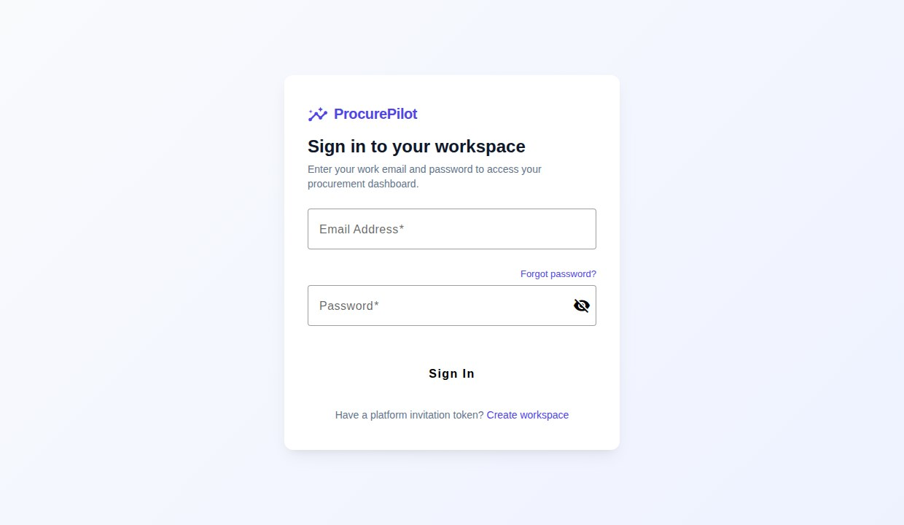

| # | Element | Description |
|---|---------|-------------|
| 1 | **ProcurePilot logo** | Brand identity — confirms you are on the correct application. |
| 2 | **Email Address field** | Enter the work email associated with your workspace account. |
| 3 | **Forgot password? link** | Opens the password-reset flow. You will receive a reset email. |
| 4 | **Password field** | Enter your account password. The eye icon toggles visibility. |
| 5 | **Sign In button** | Authenticates your session and redirects to the Dashboard. |
| 6 | **Create workspace link** | If you have a platform invitation token, this starts the sign-up flow to create a new business workspace. |

**Tips:**
- ProcurePilot supports English and Arabic. Language can be changed after sign-in from the account menu.
- If you receive an "Invalid email or password" error, check your email address for typos or use **Forgot password?** to reset.

**Business value:** secure sign-in and invitation-gated workspace creation protect supplier pricing, savings evidence, and operational settings from unauthorized access. The flow also ensures each user enters the correct isolated workspace before procurement data is shown.

### Password reset

**Route:** `/auth/password-reset`

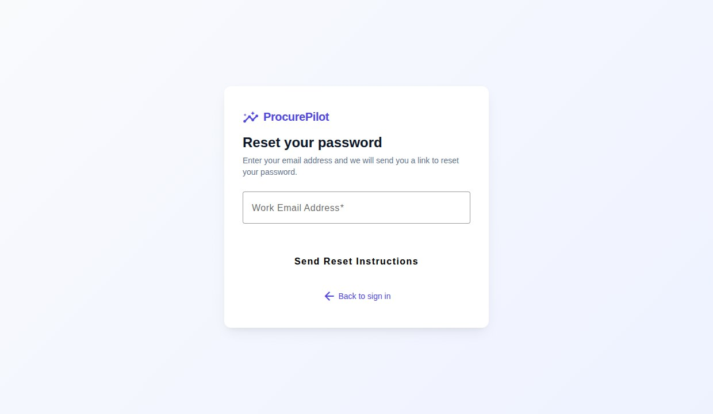

Enter your work email and submit the form to request a reset email. The flow stays outside the authenticated app shell, so users who are locked out can recover access without selecting a workspace first.

### Create workspace

**Route:** `/onboarding/signup`

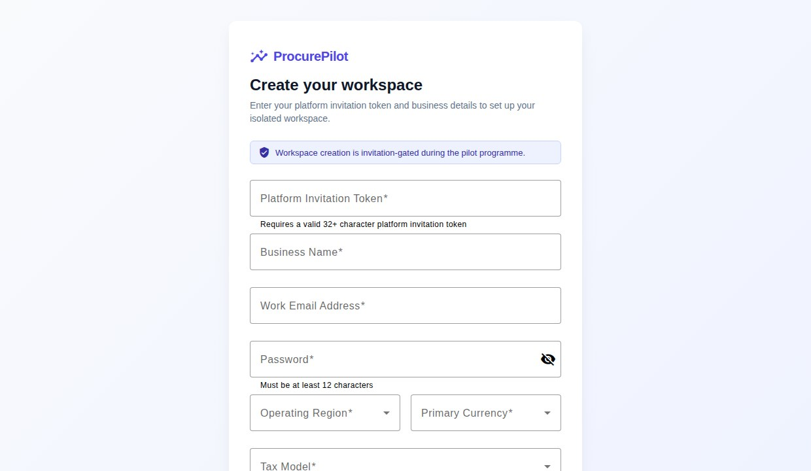

Workspace creation is invitation-gated during the pilot programme. The form captures the platform invitation token, business name, owner email, password, operating region, primary currency, tax model, and default locale; successful completion creates the isolated tenant and first owner account.

### Accept invitation

**Route:** `/onboarding/accept-invitation?token=...`

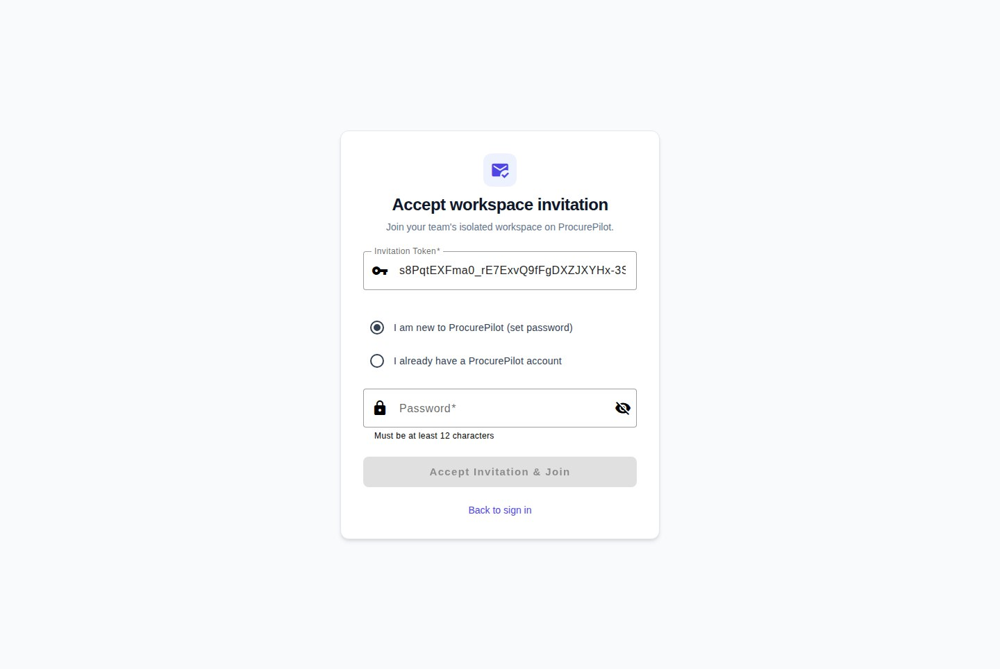

Invited members arrive here from their email link. The token identifies the pending invitation, then the user signs in or creates credentials before being added to the workspace with the role assigned by the owner.

---

## 2. Dashboard

**Route:** `/home`

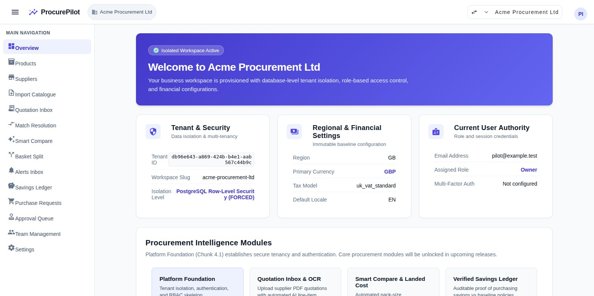

| # | Element | Description |
|---|---------|-------------|
| 1 | **Top bar** | Shows the ProcurePilot brand, your active workspace name, and the account menu (workspace switcher, language toggle, sign out). |
| 2 | **Side navigation** | Provides module switching for authenticated users. It is shown separately below so page screenshots can focus on the work area. |
| 3 | **Welcome banner** | Displays your workspace name and confirms your workspace is provisioned with database-level tenant isolation and role-based access control. |
| 4 | **Tenant & Security card** | Shows your Tenant ID, workspace slug, and the isolation level (PostgreSQL Row-Level Security, FORCED). This is read-only and confirms your data is fully isolated. |
| 5 | **Regional & Financial Settings card** | Displays your region (e.g. GB), primary currency (e.g. GBP), tax model (e.g. uk_vat_standard), and default locale. These are set at sign-up and are immutable. |
| 6 | **Current User Authority card** | Shows your email, assigned role (Owner, Buyer, etc.), and MFA status. |
| 7 | **Procurement Intelligence Modules** | A roadmap card describing each module. **Note:** the "Active"/"Upcoming" labels on this card describe the original chunk plan and have not been refreshed since — Quotation Inbox, Smart Compare, and Savings Ledger are fully built and in active use even though the card may still read "Upcoming." Use the side navigation, not this card, to judge what's actually available. |

### Authenticated app sidebar

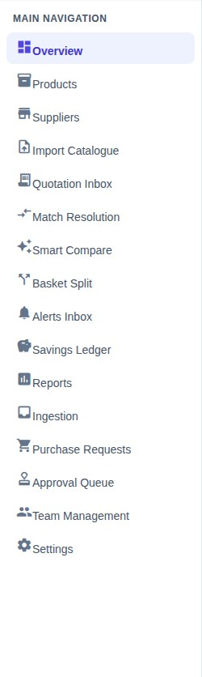

| # | Element | Description |
|---|---------|-------------|
| 1 | **Main navigation section** | Groups the workspace modules available after sign-in. |
| 2 | **Overview** | Opens the Dashboard and workspace security summary. |
| 3 | **Products** | Opens the Product Catalogue. |
| 4 | **Suppliers** | Opens supplier records and supplier profile management. |
| 5 | **Import Catalogue** | Opens the CSV import workflow for bulk product updates. |
| 6 | **Quotation Inbox** | Opens quotation upload, review, authorization, and audit-trail workflows. |
| 7 | **Match Resolution** | Opens quotation-line product matching tasks. |
| 8 | **Smart Compare** | Opens supplier offer comparison and price intelligence tools. |
| 9 | **Basket Split** | Opens the two-supplier basket optimisation workflow. |
| 10 | **Alerts Inbox** | Opens detected pricing and procurement alerts. |
| 11 | **Savings Ledger** | Opens savings records, evidence, outcome capture, and export workflows. |
| 12 | **Purchase Requests / Approval Queue** | Opens request intake and approval tracking screens for enabled roles. |
| 13 | **Team Management / Settings** | Opens member administration and organisation configuration screens. |

**Business value:** the dashboard gives users a quick confidence check that they are in the right workspace, under the right role, with the right tenant isolation and financial settings. That reduces setup uncertainty before they begin uploading quotes, comparing offers, or approving spend.

---

## 3. Product Catalogue

**Route:** `/products`

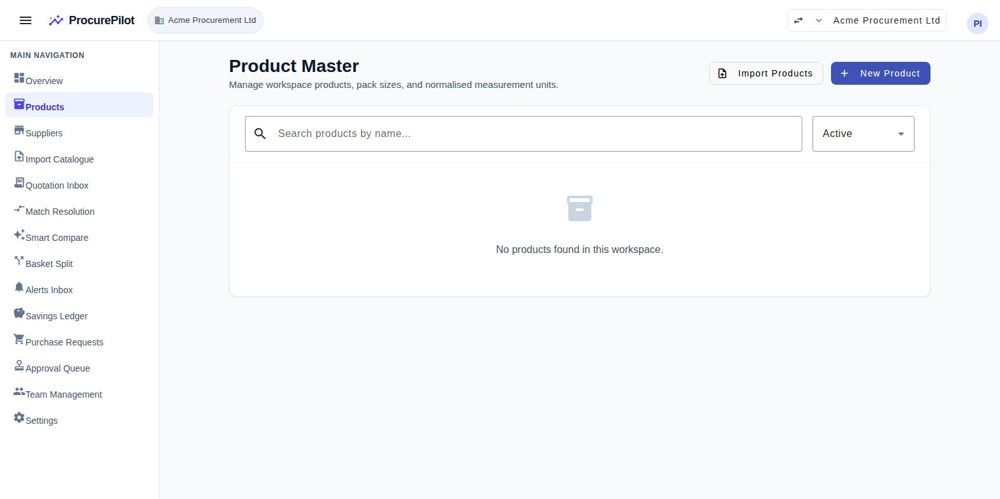

| # | Element | Description |
|---|---------|-------------|
| 1 | **Page title — "Product Master"** | The master list of all products in your workspace. Products are the items you purchase and compare across suppliers. |
| 2 | **Import Products button** | Opens the Import Wizard to bulk-upload products from a CSV file. |
| 3 | **+ New Product button** | Opens the product creation form to add a single product manually. |
| 4 | **Search bar** | Type to filter products by name. The search is instant and case-insensitive. |
| 5 | **Status filter dropdown** | Filter by Active, Archived, or All products. Archived products are hidden from comparison and request flows. |
| 6 | **Product table** | Lists all products with columns for name, brand, variant, GTIN, pack definition, normalised base quantity, and status. Click the pencil icon to edit; the red icon archives a product. |
| 7 | **Empty state** | When no products exist, a prompt guides you to add your first product. |

**Workflow:**
1. Start by importing your existing product list via CSV, or add products one by one.
2. Each product needs at minimum a **name** and a **base measurement unit** (kg, litre, piece, etc.).
3. Products can be archived (soft-deleted) — they are never hard-deleted.

**Business value:** the product catalogue is the vocabulary that makes every later comparison possible. Clean product identities reduce duplicate spend, group supplier volume for negotiation, and stop teams from comparing two offers that look similar but refer to different products or pack sizes.

---

## 4. Create / Edit Product

**Route:** `/products/new` or `/products/:id`

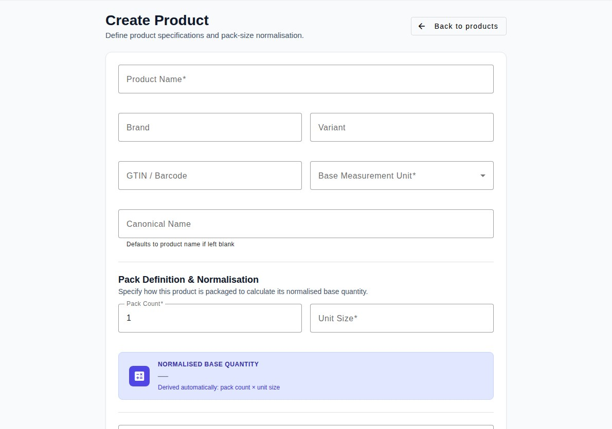

| # | Element | Description |
|---|---------|-------------|
| 1 | **Product Name** (required) | The primary display name for this product across the system. |
| 2 | **Brand** | The manufacturer or brand. Used as a matching signal when AI resolves extracted quotation lines. |
| 3 | **Variant** | Size, colour, flavour, or other distinguishing detail. |
| 4 | **GTIN / Barcode** | The Global Trade Item Number (EAN/UPC). When present, this is the strongest matching signal for quotation extraction. |
| 5 | **Base Measurement Unit** (required) | The unit used for price normalisation — Each, Gram, Kilogram, Litre, Millilitre, etc. All suppliers' prices are normalised to this unit so you can compare like-for-like. |
| 6 | **Canonical Name** | An optional standardised name. If left blank, it defaults to the product name. |
| 7 | **Pack Definition & Normalisation** | Define how this product is packaged. **Pack Count** (e.g. 5) times **Unit Size** (e.g. 500 each) equals the **Normalised Base Quantity**, calculated live as you type — e.g. `5 × 500 each = 2500 each`. |
| 8 | **Preferred Supplier** | Optionally assign a default supplier for this product. |

**Key concept — Pack Normalisation:**
A supplier may quote "1 case of 12 x 500ml bottles" while another quotes "1 pack of 6 x 1L bottles." ProcurePilot normalises both to a per-litre price so you see the true cost comparison.

**Business value:** pack normalisation protects margin. It exposes when a low unit price is only low because the pack, size, or base unit is different, and it gives buyers a defensible per-unit basis for supplier negotiation.

---

## 5. Suppliers

**Route:** `/suppliers`

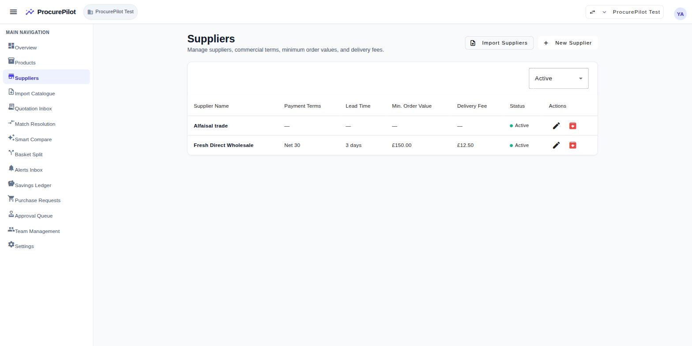

| # | Element | Description |
|---|---------|-------------|
| 1 | **Page title — "Suppliers"** | The master list of all suppliers in your workspace. |
| 2 | **Import Suppliers button** | Bulk-import suppliers from a CSV via the Import Wizard. |
| 3 | **+ New Supplier button** | Opens the supplier creation form. |
| 4 | **Status filter** | Filter by Active, Preferred, Blocked, Archived, or All. Blocked suppliers trigger a policy flag if their offers appear in Smart Compare. |
| 5 | **Supplier table** | Lists all suppliers with columns for name, payment terms, lead time, minimum order value, delivery fee, and status. Click the pencil icon to edit. |

**Supplier statuses:**
- **Active** — available for quotations and purchasing.
- **Preferred** — prioritised in recommendations.
- **Blocked** — offers from this supplier are flagged in Smart Compare; purchasing requires an exception.
- **Archived** — hidden from active workflows.

**Business value:** supplier profiles turn supplier knowledge into reusable operating data. Payment terms, lead time, delivery fees, minimum order values, and status all influence the true business cost of buying, so ProcurePilot can recommend the supplier that is commercially best, not just cheapest on the line item.

### Create Supplier form

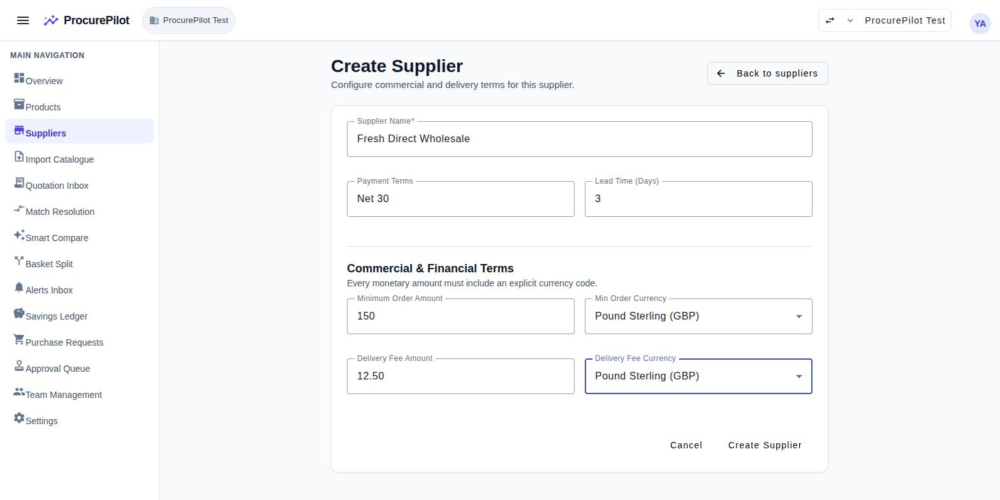

| # | Element | Description |
|---|---------|-------------|
| 1 | **Supplier Name** (required) | The only mandatory field — a supplier can be created with just a name and completed later. |
| 2 | **Contact Email** | The address ProcurePilot sends RFQs to when you include this supplier in a Create RFQ send (§34). Optional, but validated as a real email address if you enter one. A supplier with no contact email on file simply won't appear in the RFQ supplier picker — there's no other purchasing workflow it blocks. |
| 3 | **Payment Terms** | Free text, e.g. "Net 30". |
| 4 | **Lead Time (Days)** | Typical delivery lead time, used in Smart Compare's scoring. |
| 5 | **Minimum Order Amount / Currency** | Both fields are required together — Constitution Principle VII: no bare numbers for money. Leave both blank if there is no minimum. |
| 6 | **Delivery Fee Amount / Currency** | Same paired-currency rule as the minimum order amount. |

---

## 6. Import Wizard

**Route:** `/import`

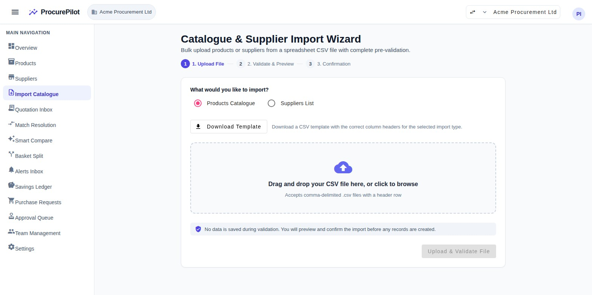

| # | Element | Description |
|---|---------|-------------|
| 1 | **Import type selector** | Choose whether to import a **Products Catalogue** or a **Suppliers List**. |
| 2 | **Drag-and-drop zone** | Drag a CSV file here or click to browse. Accepts comma-delimited `.csv` files with a header row. |
| 3 | **Safety notice** | "No data is saved during validation" — you will preview and confirm before any records are created. |
| 4 | **Upload & Validate File button** | Uploads the file, parses it, and shows a preview with validation results. Duplicates can be handled with "skip" or "update" policies. |

**Tips:**
- Prepare your CSV with a header row matching the column names shown in the app's own product/supplier tables (product name, brand, variant, GTIN, base unit, pack details for products; name, payment terms, lead time, minimum order value/currency, delivery fee/currency for suppliers).
- The wizard detects duplicates by GTIN (products) or name (suppliers) and lets you choose to skip or update existing records.

**Business value:** import reduces time-to-value. A business can bring its existing product and supplier records into ProcurePilot quickly, while preview and validation prevent messy spreadsheet data from polluting the trusted purchasing dataset.

---

## 7. Quotation Review Queue

**Route:** `/quotations`

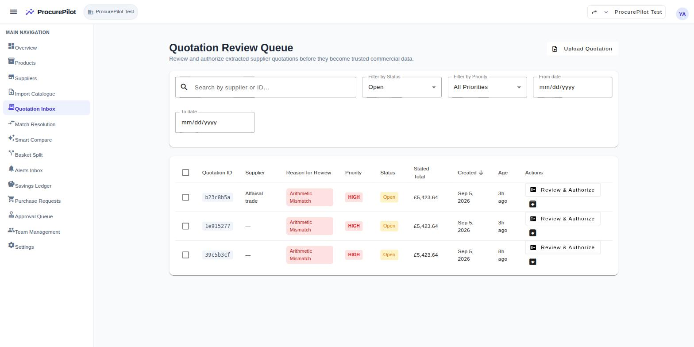

| # | Element | Description |
|---|---------|-------------|
| 1 | **Page title — "Quotation Review Queue"** | Lists all quotations that have been extracted and need human review before they become trusted commercial data. |
| 2 | **Upload Quotation button** | Opens the upload screen to add a new supplier quotation. |
| 3 | **Search by supplier or ID** | Instant, case-insensitive search across the queue. |
| 4 | **Filter by Status** | Open, Resolved, or All. |
| 5 | **Filter by Priority** | High, Medium, Low, or All — priority is set based on the reason for review (an arithmetic mismatch is always High). |
| 6 | **From date / To date** | Filters the queue by created date range. |
| 7 | **Select-all checkbox + row checkboxes** | Select one or more rows to reveal a bulk-action bar: bulk archive, bulk refuse, and bulk re-prioritise (set High/Normal/Low across the selection at once). |
| 8 | **Review task table** | Each row is clickable and shows: Quotation ID, Supplier, Reason for Review, Priority, Status, Stated Total, Created date, and **Age** (a relative "3h ago" style indicator, with the full timestamp on hover). The ID badge is shortened for scanning; the full UUID remains the backend identifier in the route and API. |
| 9 | **Review & Authorize action** | Opens the detailed review screen for that quotation. |
| 10 | **Empty state** | When no review tasks match the current filters, a message confirms this rather than showing a blank table. |

**Tips:**
- Clicking anywhere on a row (not just the ID or action button) opens the review screen.
- The "Reason for Review" shown here uses the same VAT-aware arithmetic check as the detail page, so the queue and the detail screen never disagree about whether a quotation's totals reconcile.

**Business value:** the review queue protects decision quality at scale. Instead of asking buyers to inspect every field manually, it prioritises the quotations most likely to affect trust, cost, or revenue leakage: low-confidence extraction, arithmetic mismatches, and stale unresolved reviews.

---

## 8. Upload Supplier Quotation

**Route:** `/quotations/upload`

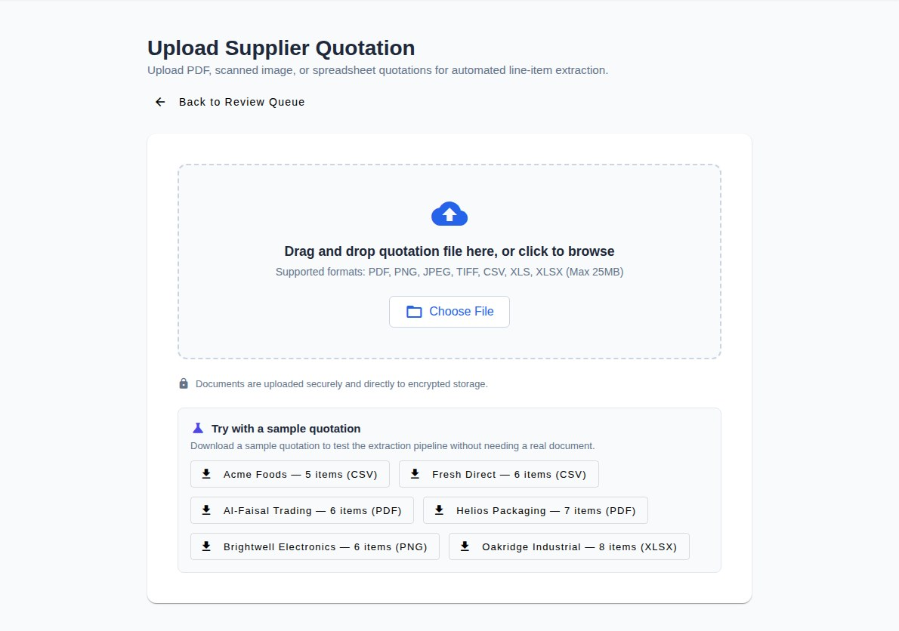

| # | Element | Description |
|---|---------|-------------|
| 1 | **Page title — "Upload Supplier Quotation"** | Upload a document to start the AI extraction process. |
| 2 | **Back to Review Queue link** | Returns to the quotation review queue without uploading. |
| 3 | **Drag-and-drop zone** | Drag a quotation file here or click **Choose File** to browse. Selecting a valid file starts the upload automatically. |
| 4 | **Supported formats** | PDF, PNG, JPEG, TIFF, CSV, XLS, XLSX — up to 25 MB. |
| 5 | **Security notice** | "Documents are uploaded securely and directly to encrypted storage." |
| 6 | **Try with a sample quotation** | Six pre-built sample quotations covering every supported format, so you can test the extraction pipeline without a real supplier document: **Acme Foods** (5 items, CSV), **Fresh Direct** (6 items, CSV), **Al-Faisal Trading** (6 items, PDF), **Helios Packaging** (7 items, PDF), **Brightwell Electronics** (6 items, PNG), and **Oakridge Industrial** (8 items, XLSX). |

**After upload:**
1. The file is uploaded via a presigned URL directly to encrypted storage.
2. An extraction job starts automatically (usually under 45 seconds per page).
3. A progress indicator shows the extraction state (uploading → processing → extracted).
4. When complete, a **Proceed to Review** link appears with the new quotation ID. Click it to inspect the extracted data, or upload another quotation.

**Business value:** upload removes the manual retyping bottleneck. More supplier quotes can be captured before prices expire, and every extracted value remains tied to the source document so later savings claims can be defended.

---

## 9. Quotation Review & Authorization

**Route:** `/quotations/:id/review`

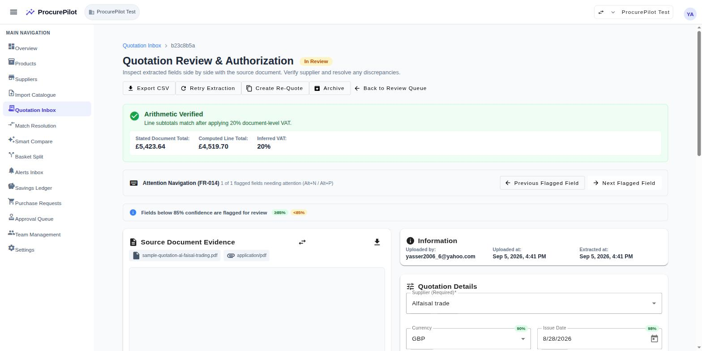

After AI extraction finishes, each quotation lands in the review queue. Open a review task to inspect, correct, and authorize the extracted data before it feeds into matching and comparison.

| # | Element | Description |
|---|---------|-------------|
| 1 | **Breadcrumb** | "Quotation Inbox › {id}" — click to return to the queue. The visible ID is shortened; the full quotation UUID remains in the URL. |
| 2 | **Action bar** | Always includes Export CSV (download extracted header + lines) and Back to Review Queue. Users with write access also see Archive. Retry Extraction appears only while the quotation is `Extracted`, `In Review`, or `Refused`; it is hidden after the quotation is reviewed. Create Re-Quote appears before authorization and is hidden once the quotation reaches `Reviewed & Authorized`. |
| 3 | **Arithmetic status banner** | Green "Arithmetic Verified" when line subtotals reconcile with the stated total (after applying any inferred document-level VAT), or an amber "Arithmetic Discrepancy Detected" banner showing both figures side by side when they don't, with a checkbox to proceed anyway with an acknowledgement. |
| 4 | **Attention-required navigation** | Counts and lets you step through fields flagged for review (low confidence or extraction warnings) with **Previous/Next Flagged Field** buttons and the Alt+N / Alt+P keyboard shortcuts. |
| 5 | **Confidence legend** | An info bar explaining the 85% confidence threshold, with green (≥85%) and amber (<85%) badge examples, so you know what triggers a flag before you start reviewing fields. |
| 6 | **Source document evidence panel** | The original uploaded document evidence shown alongside the extraction results, with source metadata and a download button for the original file via a time-limited secure URL. Renderable formats show the document preview controls; structured CSV/XLSX uploads show the secure file evidence and extracted fields. |
| 7 | **Quotation details form** | Editable header fields: supplier, currency, issue date, expiry date, and stated total. The supplier field is a dropdown loaded from the workspace supplier list, with a small **Add a supplier** link to create a missing supplier manually. If the supplier list is completely empty, an empty-state message also links directly to supplier creation. When no supplier is selected and the quotation has an extracted vendor name, the page can offer to create that supplier directly even if other suppliers already exist. If the extracted vendor resembles an existing supplier, a supplier-match banner appears below the dropdown — see below. Each field shows its confidence score. |
| 8 | **Expiry badge** | Next to the Expiry Date field, a "Valid for N days" (or "Expired") badge makes quote validity visible at a glance instead of a plain date. |
| 9 | **Extracted line items table** | One row per line, expandable to show quantity, pack details, unit price, delivery fee, discount, VAT %, and line total. Add lines with **+ Add Line Item**. Remove an existing editable line with the trash icon in that line's header; removal is staged and only applied when you save corrections. The computed total recalculates live as you edit any field or add/remove a line. |
| 10 | **Field provenance panel** | For the field currently in focus, shows the extraction method, model version, source page, original AI value, and (if edited) the corrected value and who corrected it — labelled "Corrected by Human" on any field you've changed. |
| 11 | **Reviewer Notes** | A free-text field for recording why a correction was made or leaving context for whoever authorizes the quotation. Saved together with corrections. |
| 12 | **Audit Trail** | An expandable panel at the bottom logging every action taken on this quotation — upload, extraction, field corrections, status changes, matching setup, automatic match acceptance, and reviewer match decisions — with actor and timestamp. |
| 13 | **Save Corrections** | Persist manual edits without changing the quotation's status — you can return later. |
| 14 | **Confirm & Authorize Quotation** | Marks the quotation as reviewed. Matching setup then shows loading, ready, or a retryable error; when ready, **Continue to Product Matching** opens only this quotation's matching group. A confirmation dialog states plainly that authorization **cannot be undone**. |

**Supplier auto-match:** when the extracted vendor name resembles one of your existing suppliers closely enough, a banner appears below the supplier dropdown offering to pre-select it ("Suggested: {name} — {pct}% match", or a more tentative "Possible match" wording for a lower-confidence guess) — you still confirm it explicitly, nothing is ever auto-selected. If no reasonable match is found but a vendor name was extracted, the banner can instead offer to create the supplier directly from that name without leaving the page.

**After authorization:** once a quotation is confirmed, product matching runs only against that reviewed quotation. Lines with a strong deterministic match, such as a known GTIN, supplier product code, or previously learned supplier wording, can be accepted automatically. Lines that are uncertain become match-resolution tasks instead of being silently used in comparison.

**Review workflow:**
1. Open a task from the review queue (section 7).
2. Check the arithmetic status banner — if it flags a discrepancy, compare stated total against the line sum.
3. Walk through attention-required fields, correcting any extraction errors inline — the totals and mismatch banner update as you go.
4. Confirm or add the supplier, using the auto-match banner if one appears.
5. Click **Save Corrections** to persist your edits, or go straight to **Confirm & Authorize Quotation** once satisfied. Wait for matching setup to report ready, then use **Continue to Product Matching**; retry setup if the page reports a failure.

**Business value:** quotation review turns AI output into trusted commercial data. A wrong supplier, date, quantity, or total can create a false recommendation and a false saving; this page makes the reviewer's corrections auditable before the data affects matching, comparison, or reporting.

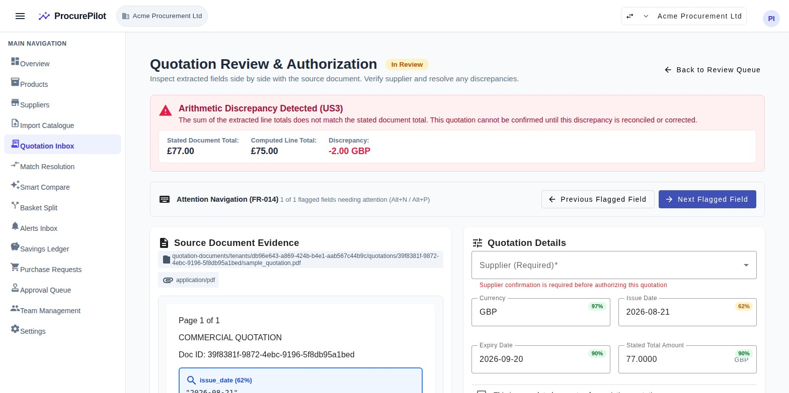

---

## 10. Match Resolution Queue

**Route:** `/matching`

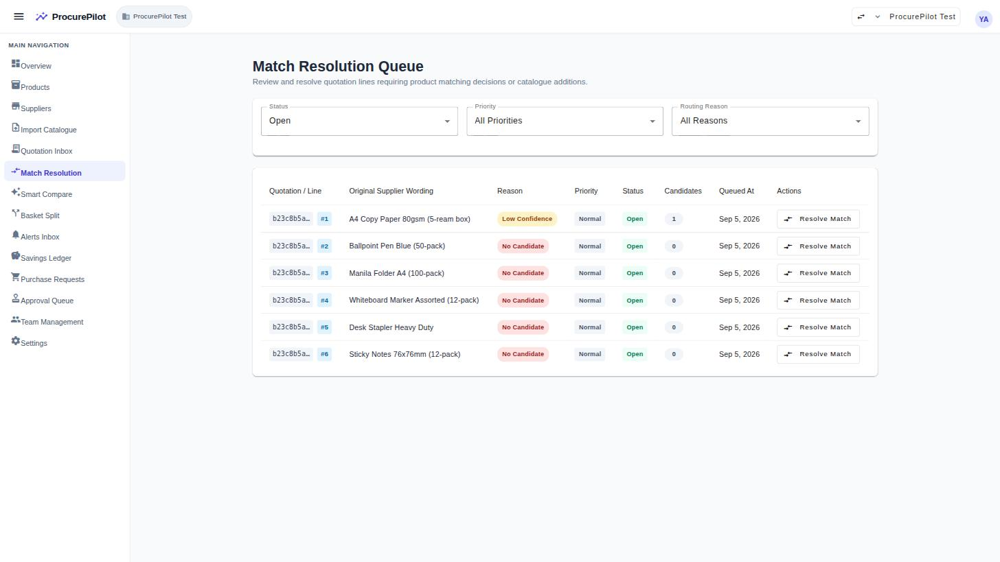

| # | Element | Description |
|---|---------|-------------|
| 1 | **Page title — "Match Resolution Queue"** | Lists quotation lines from **confirmed** quotations that need a human decision: which catalogue product each extracted line refers to. Matching only runs once a quotation has been authorized (section 9). |
| 2 | **Search by supplier or ID** | Filters tasks by supplier wording, supplier name, quotation ID, or line identifier. |
| 3 | **Status filter** | `Awaiting Match Decision` (open), `Being Reviewed` (in_progress), `Resolved`, `Auto-accepted` (view-only audit, `apps/web/src/app/features/matching/resolution-queue/resolution-queue.component.html:44`), or `All`. Select `Auto-accepted` to audit lines automatically matched above the threshold (deterministic GTIN/supplier-code/alias hit with high confidence) — they show a green `Auto-accepted` badge instead of a routing reason and are always `View Details` only (`component.html:172,188`). Default remains `Open` so the worklist stays focused on the ~8% needing human review. |
| 4 | **Priority filter** | Filter by priority. Auto-accepted audit items are `Normal` priority; hidden if you filter to `High`/`Low`. |
| 5 | **Routing Reason filter** | Filter by why the line was routed here: Low Confidence, No Candidate, Close Candidates, etc. Auto-accepted items use `Auto-accepted` reason and are hidden unless filter is `All`. |
| 6 | **From date / To date** | Filters tasks by when they entered the matching queue (`Auto-accepted` uses `decided_at`). |
| 7 | **Quotation groups** | Tasks are grouped by their uploaded quotation. Each group shows supplier, source filename, quotation reviewer, review time, issue date, and authoritative open/total line progress. Groups can be collapsed when you want to scan quotations without reading every line, then expanded again to resolve individual tasks. Empty queues show "No match tasks found" rather than a blank surface; filtering to `Auto-accepted` with no matches shows the same empty state for that subset. |
| 8 | **Line evidence** | Each line shows its displayed line number, complete supplier wording with **queue age directly beneath it** (relative time like `just now`, `2h ago`, `3d ago` — full `created_at` on hover via `schedule` icon, `apps/web/src/app/features/matching/resolution-queue/resolution-queue.component.html:157`, `ageLabel()` `component.ts:265`), quoted exposure with currency, routing reason **or** `Auto-accepted` badge, top candidate and score, and matching status (`Awaiting Match Decision` / `Resolved` / `Auto-accepted`). `Below Match Threshold` refers to product matching, not OCR or quotation-review confidence. A line may be fully extracted and arithmetically verified in quotation review while still needing a product-matching decision here. |
| 9 | **Resolve Match / View Details action** | Opens the resolution screen for that quotation line while preserving quotation context. The line itself is not clickable, so keyboard and screen-reader users get one predictable action target. Human-resolved lines and **all auto-accepted lines** use the view-only `View Details` action for auditing (`component.html:193`); only open `Awaiting Match Decision` lines show `Resolve Match` (for Owner/Buyer). |

### Match Resolution detail

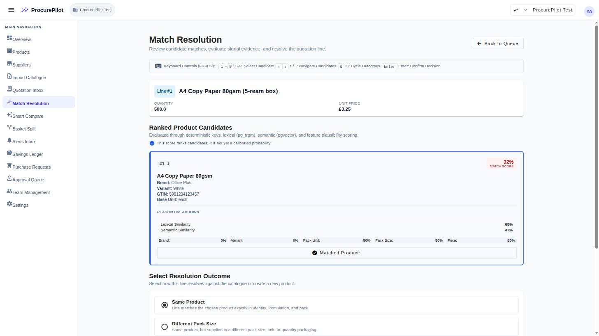

| # | Element | Description |
|---|---------|-------------|
| 1 | **Keyboard Controls bar** | 1–9 selects a candidate by rank, arrow keys navigate, O cycles through outcomes, Enter confirms the decision — the whole screen is operable without a mouse. |
| 2 | **Line detail** | The extracted line text, quantity, unit price, quoted line exposure, and any mixed-currency warning for context. This lets you compare the matching decision against the value that will later appear in Smart Compare. |
| 3 | **Ranked Product Candidates** | Each candidate card shows the product's brand, variant, GTIN, and base unit, plus a **Match Score** and a reason breakdown (GTIN match, supplier-code match, alias hit, lexical similarity, brand/variant/pack-unit/pack-size/price agreement, and semantic signal where available). An explainer states plainly that this score ranks candidates — **it is not yet a calibrated probability** — so treat it as a ranking signal, not a statistical confidence level. |

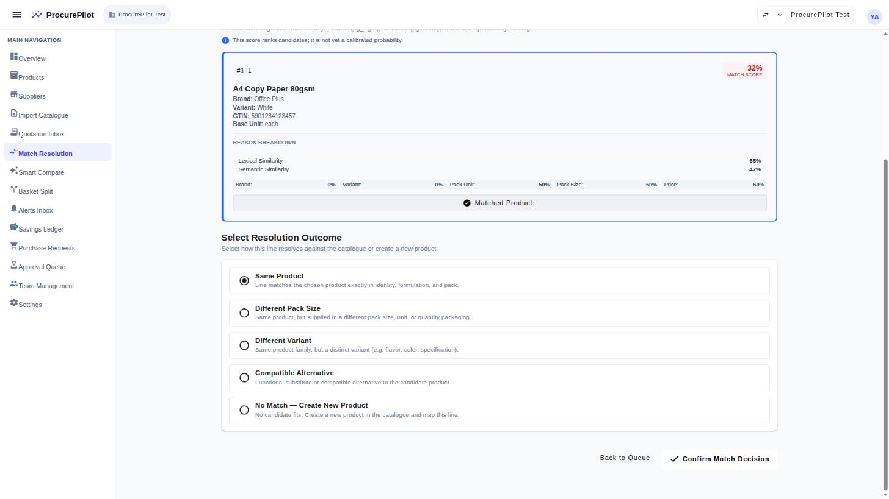

| # | Element | Description |
|---|---------|-------------|
| 4 | **Select Resolution Outcome** | Choose how the line resolves: **Same Product** (exact match), **Different Pack Size** (same product, different packaging), **Different Variant** (same family, different specification), **Compatible Alternative** (functional substitute), or **No Match — Create New Product** (adds a new catalogue product and maps this line to it). Close-candidate tasks require an explicit candidate choice; the screen does not preselect the top ranked option for you. |
| 5 | **Confirm Match Decision** | Saves the outcome. Confirming "Same Product" (or any outcome that selects a candidate) also learns the exact supplier wording as an alias, so an identical wording on a future quotation resolves automatically without going through this queue again. If the same save request is retried because of a network interruption, ProcurePilot reuses the original saved decision instead of creating a duplicate. |

**Business value:** matching is where supplier wording becomes business intelligence. It prevents fake comparisons, teaches the system each supplier's vocabulary, and reduces future operating work because repeated descriptions can resolve automatically once a human has confirmed them. Filtering `Status = Auto-accepted` makes the auto-accept precision claim auditable without polluting the default `Open` worklist.

**Audit note:** match-routing, automatic acceptance (`matching.auto_accepted`), and human resolution (`matching.resolved`) events are written to the quotation audit trail and are also surfaced read-only via `Status = Auto-accepted` or the quotation's match overview (`GET /quotations/{id}/matches`). Matching and landed-cost history is append-only; corrections to a confirmed match require a future correction/supersession workflow rather than editing the saved decision in place. Use `View Details` on an auto-accepted line to inspect its candidate, score, and landed cost — no `Resolve` is offered.

---

## 11. Smart Compare

**Route:** `/offers/compare`

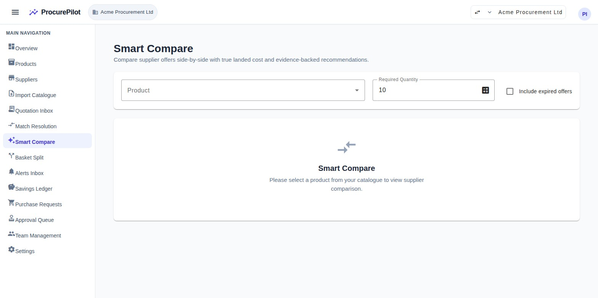

| # | Element | Description |
|---|---------|-------------|
| 1 | **Page title — "Smart Compare"** | Compare supplier offers side-by-side with true landed cost and evidence-backed recommendations. |
| 2 | **Product selector** | Select a product from your catalogue to see all available supplier offers. |
| 3 | **Required Quantity field** | Enter the quantity you need. Prices recalculate live — tiers, minimum order values, and delivery thresholds update instantly. |
| 4 | **Include expired offers toggle** | Check to include expired quotation offers in the comparison. |
| 5 | **Recommended Offer banner** | Shown when a matched and costed offer exists: a confidence badge (High/Medium/Low), a recommendation score, risk considerations (e.g. "Product match confidence is below 85%"), validity window, and scoring evidence breakdown. When Supplier IQ risk evaluation influenced the recommendation, a **Supplier IQ / Risk** evidence chip and risk panel appear with a direct **View Supplier Scorecard** link. |
| 6 | **Comparison table** | Each row is one supplier offer: unit price, total landed cost, lead time, reliability, stock availability, match confidence, validity, and status. Next to each supplier's name, a scorecard icon button allows navigating directly to that supplier's detailed Supplier IQ scorecard (`/suppliers/:id/scorecard`). |
| 7 | **Record Purchase action** | From the banner or any table row, click "Record Purchase" to open the outcome-capture form (section 15) and have the savings automatically calculated. |

**Business value:** Smart Compare converts cleaned data into a buying decision. It lowers recurring purchasing cost, gives buyers evidence for negotiation, and helps owners see why a recommendation was made before money is spent.

**Data readiness:** Smart Compare depends on the full chain being complete: upload quotation → review and authorize → resolve product matching where needed → compute landed cost. If an expected quote is missing from comparison, check the Quotation Review Queue and Match Resolution Queue first.

**Related screens:**
- **Basket Split & Advanced Optimiser** — see next section.

### Product Price Intelligence

**Route:** `/offers/product-intelligence` or `/offers/product-intelligence/:id`

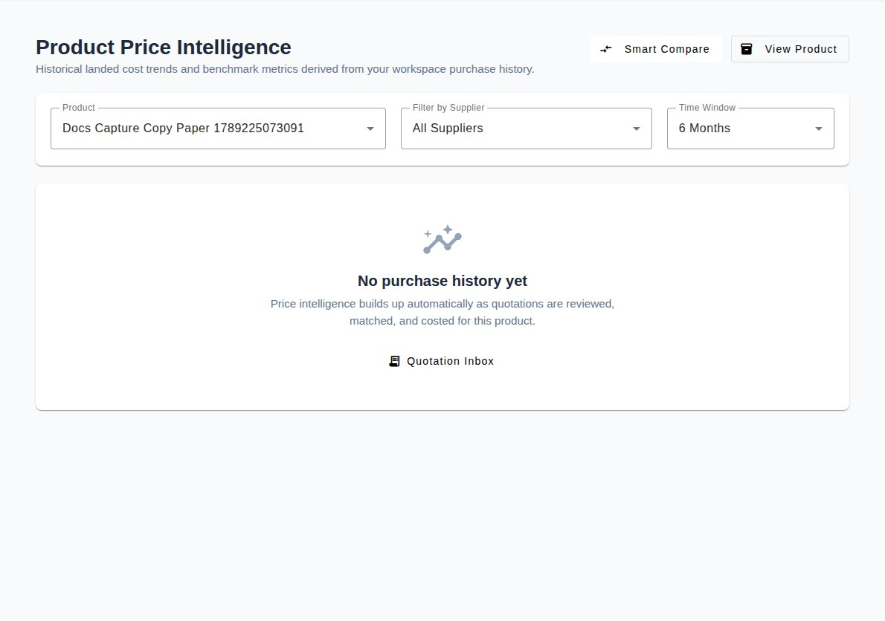

| # | Element | Description |
|---|---------|-------------|
| 1 | **Product selector** | Choose the catalogue product whose price history you want to inspect. A product ID in the route preselects this field. |
| 2 | **Supplier filter** | Restrict the history to one supplier or keep all suppliers. |
| 3 | **Time window** | Switch between the available history windows, such as 6 months. |
| 4 | **Price intelligence panel** | Shows landed-cost trend metrics and historical records once reviewed quotations have been matched and costed for the selected product. Until then, the page displays a no-history state with a link back to the Quotation Inbox so you can build source data. |
| 5 | **Smart Compare / View Product actions** | Jump back to Smart Compare or open the selected product's catalogue record. |

**Business value:** price intelligence gives the business purchase memory. It helps buyers challenge increases, spot supplier drift, time negotiations, and decide whether a current offer is truly good compared with actual historical landed cost.

---

## 12. Basket Split & Advanced Optimiser

**Route:** `/offers/basket-split`

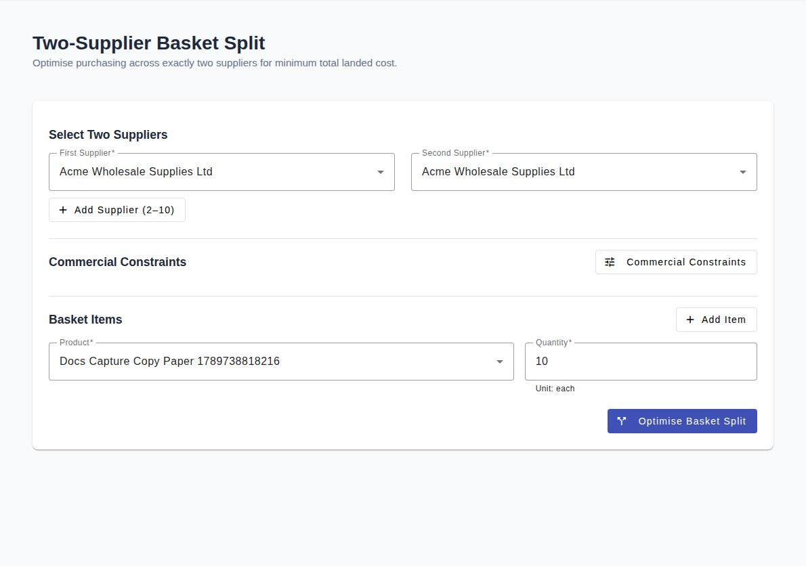

| # | Element | Description |
|---|---------|-------------|
| 1 | **Page title — "Two-Supplier Basket Split" / Multi-Supplier Optimisation** | Optimise purchasing across 2 to 10 selected suppliers for minimum total landed cost using an exact constraint-programming solver (Google OR-Tools CP-SAT). |
| 2 | **Supplier selectors** | Choose 2 to 10 suppliers. The selector dynamically enforces mutual exclusion. |
| 3 | **Commercial Constraints panel** | Toggle to configure supplier commercial terms: Minimum Order Values (MOV), Free Delivery Thresholds, Delivery Fees, and Quantity Tiers. |
| 4 | **Risk & Urgency controls** | Set Risk Tolerance (`low`, `medium`, `high`), Delivery Urgency (`normal`, `urgent`), and explicit supplier exclusions. |
| 5 | **Optimisation Weights** | Customise relative weighting sliders for price, preferred suppliers, risk, lead time, and quality. |
| 6 | **Basket Items section** | Add catalogue products and required quantities. Click **+ Add Item** to add more lines. |
| 7 | **Optimise Basket button** | Submits the constrained basket to the solver. Execution runs asynchronously with live polling. |

**Results and Analysis:**
- **Feasible Allocation:** Clear per-supplier breakdown detailing assigned items, quantities, sub-totals, delivery fees, and overall minimum landed cost.
- **Single-Supplier Baselines:** Evaluates whether splitting across suppliers saves money versus purchasing entirely from a single supplier.
- **Applied & Violated Constraints:** Inspect which commercial terms (MOV, delivery fee) were applied and which constraints were violated if infeasible.
- **Advisory-Only Protection:** In strict adherence to system principles, basket optimisation is purely advisory and never autonomously creates orders or commits funds.

**Business value:** basket optimisation finds the lowest total landed cost across a real order, not just the cheapest line item. It accounts for supplier minimums, delivery fees, price tiers, urgency, risk, and quality so buyers can avoid overpaying because of supplier constraints while still keeping the final purchasing decision human-authorized.

---

## 13. Supplier Scorecards & Supplier IQ

**Route:** `/suppliers/:id/scorecard`

| # | Element | Description |
|---|---------|-------------|
| 1 | **Scorecard Header** | Supplier name, rule version (`supplier-risk-v1`), and back-link to supplier profile. |
| 2 | **Time Window Selector** | Toggle analysis window between 3, 6, and 12 months. |
| 3 | **Overall Risk Score Card** | Weighted composite risk score (0-100%) with risk level indicator (Low/Medium/High) and component breakdown. |
| 4 | **Performance Metrics Grid** | Dense operational cards displaying Fulfilment Rate, On-Time Delivery, Quality Incident Rate, Price Competitiveness, Spend Exposure, and Dispute Rate. |
| 5 | **Evidence Sources Panel** | Transparent transaction counts showing total quotations, delivery confirmations, and quality issue records analysed. |
| 6 | **Insufficient Evidence State** | Automatically flagged when transaction history is sparse, informing buyers that scores reflect limited sample observations. |

**Business value:** Supplier IQ transforms fragmented operational and commercial records into defensible risk indicators, empowering buyers to detect vendor drift and quality issues before awarding orders.

**R4.1 extension:** this page now ends with a **Supplier Risk Evidence** panel (the v2 risk model, with a component-level evidence table and a **Prepare negotiation brief** button) and is also reachable from a workspace-wide **Supplier Risk Queue**. See [§32 Supplier Risk Queue & Negotiation Briefs](#32-supplier-risk-queue--negotiation-briefs).

---

## 14. Alerts Inbox & Anomaly Detection

**Route:** `/alerts`

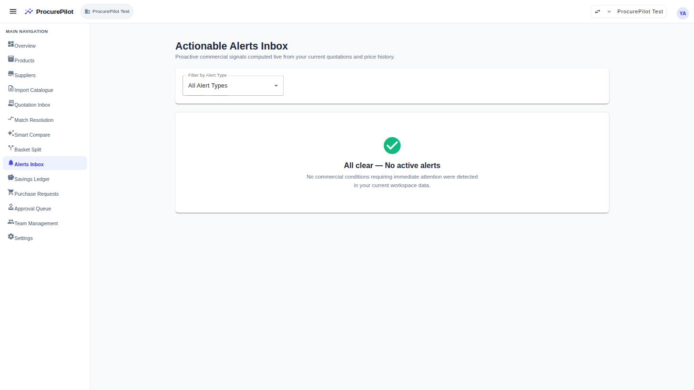

| # | Element | Description |
|---|---------|-------------|
| 1 | **Page title — "Actionable Alerts Inbox"** | Proactive commercial signals and anomaly alerts computed live from current quotations, deliveries, and price history. |
| 2 | **Filter by Alert Type** | Filter by type: Price Expiring, Supplier Disappeared, Price Swing, Price Spike, Duplicate Quotation Line, Decimal/Quantity Anomaly, Delivery Cost Anomaly, Quality Trend Change, or All. |
| 3 | **Alert cards** | Each alert displays severity (info/warning/critical), confidence rating (High/Medium/Low), affected supplier/product, recurrence key, and actionable routing. |
| 4 | **Action routing links** | Direct action buttons: **Inspect Scorecard** (navigates to Supplier Scorecard), **Review Quotation** (navigates to quotation review), **Compare Offers**, or **View Delivery Issues**. |
| 5 | **Dismiss action** | Dismisses alerts with recurrence suppression; recurring alerts only resurface if underlying commercial evidence changes. |
| 6 | **All clear state** | Confirms no commercial anomalies or warning conditions require immediate buyer attention. |

**Alert kinds:**
- **Price Expiring** — a quotation is about to expire and no renewal has been uploaded.
- **Supplier Disappeared** — a supplier that previously quoted for a product has not submitted a quotation in the current cycle.
- **Price Swing** — a significant price change compared to previous quotes.
- **Price Spike Anomaly** — sudden abnormal price surge compared to workspace baselines.
- **Likely Duplicate Quotation Line** — multiple identical quotation lines detected across current uploads.
- **Decimal / Quantity Anomaly** — potential decimal shift or unit-of-measure mismatch in supplier quotation.
- **Delivery Cost Anomaly** — abnormal surge in delivery fee relative to order value.
- **Supplier Quality Trend Change** — sharp increase in delivery discrepancies or quality complaints.

**Business value:** live anomaly detection intercepts erroneous quotes, supplier performance degradation, and commercial leakage before purchasing decisions are finalized.

---

## 15. Savings Ledger

**Route:** `/savings`

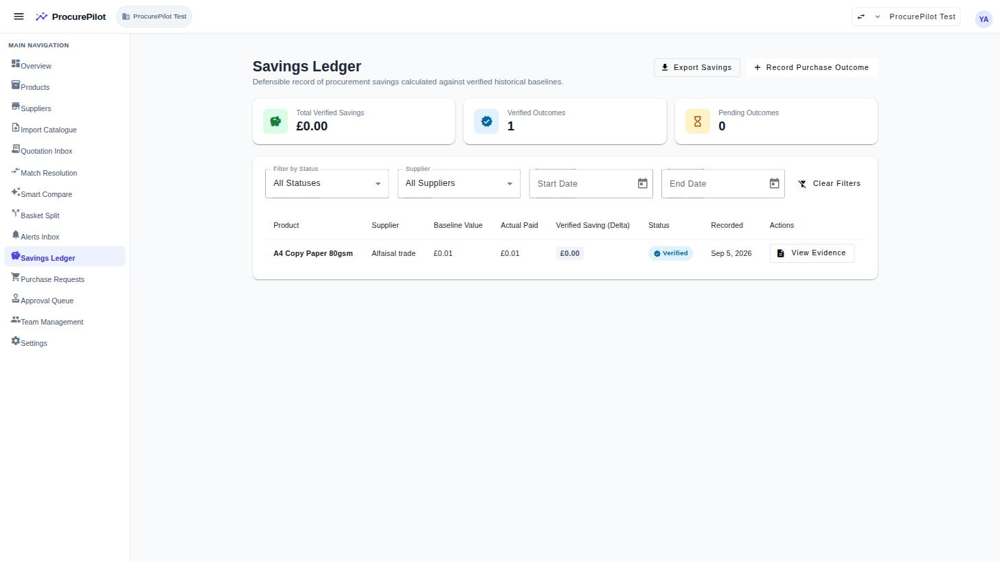

| # | Element | Description |
|---|---------|-------------|
| 1 | **Page title — "Savings Ledger"** | Defensible record of procurement savings calculated against verified historical baselines. |
| 2 | **Export Savings button** | Opens the export screen to generate an audit-ready Excel or PDF report. |
| 3 | **+ Record Purchase Outcome button** | Opens the outcome capture form (below) to record a purchase and automatically calculate savings. |
| 4 | **Stats cards** | Three summary cards: **Total Verified Savings**, **Verified Outcomes** (count), **Pending Outcomes** (count). |
| 5 | **Filters** | Status (All/Verified/Pending), supplier, and date range. **Clear Filters** resets all. |
| 6 | **Savings table** | Each row: product, supplier, baseline value, actual paid, verified saving (delta), status, and recorded date. Click **View Evidence** to drill into the full calculation. |
| 7 | **Empty state** | When no savings exist, "No savings recorded yet" with a **+ Record First Purchase** link. |

### Record Purchase Outcome

Reached from **Record Purchase** on any Smart Compare offer, or **+ Record Purchase Outcome** on the ledger itself.

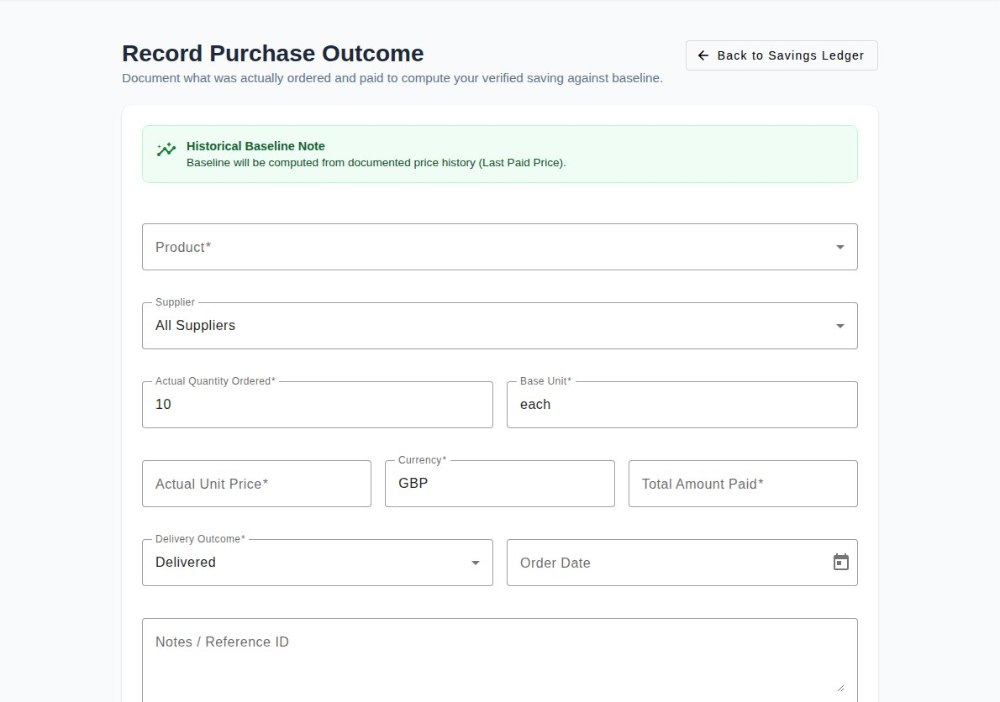

| # | Element | Description |
|---|---------|-------------|
| 1 | **Historical Baseline Note** | States which baseline policy will be used to compute the saving (e.g. "Last Paid Price"). |
| 2 | **Product / Supplier** | Pre-filled when arriving from Smart Compare. |
| 3 | **Actual Quantity Ordered / Base Unit** | What you actually bought, in the product's normalised unit. |
| 4 | **Actual Unit Price / Currency / Total Amount Paid** | What you actually paid — always with an explicit currency. |
| 5 | **Delivery Outcome** | Delivered, Partially Delivered, Not Delivered, etc. |
| 6 | **Order Date** | When the order was placed. |
| 7 | **Notes / Reference ID** | Optional free text, e.g. a PO number. |
| 8 | **Record Outcome & Compute Saving** | Saves the outcome and immediately computes the saving against the baseline, taking you to the Saving Evidence screen. If the selected product has no price history yet, the form flags that no baseline is available for that product. |

### Saving Evidence & Calculation

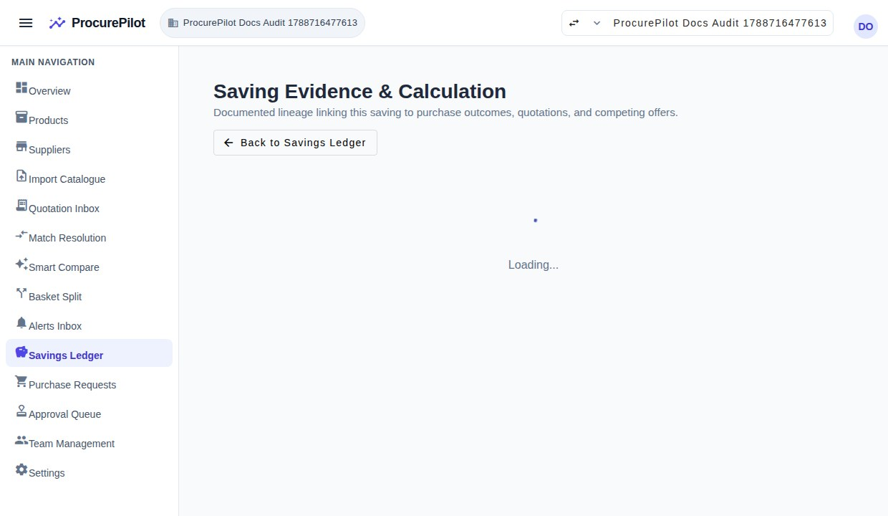

| # | Element | Description |
|---|---------|-------------|
| 1 | **Verification banner** | "Pending Verification" (amber, with a **Verify Saving** button) until an owner or buyer verifies it, after which it reads "Verified (Immutable)" (green, with a lock icon) and the record can no longer be edited or deleted. |
| 2 | **Saving Summary** | Net saving, actual vs. baseline total value, baseline unit price, baseline policy used, status, recorded/verified dates, and the calculation version. |
| 3 | **Purchase Details** | The full purchase record as entered. |
| 4 | **Calculation Snapshot** | The exact formula applied ("Baseline Value − Actual Paid = Net Saving") and the competing offers that were on the table at compare time — the full evidence chain from quotation → match → offer → purchase → saving. |

**Key concept — Verified Savings:**
- Verified savings are **immutable** — once verified, they cannot be edited or deleted. If a correction is needed, a new adjustment record is created.
- The evidence chain traces from quotation → match → offer → purchase → saving, providing full auditability.

**Business value:** savings only matter when they can be proven. The ledger connects recommendation, purchase outcome, baseline, and evidence so owners can measure real procurement impact, report it confidently, and avoid inflated or unverifiable savings claims.

---

## 16. Export Savings

**Route:** `/savings/export`

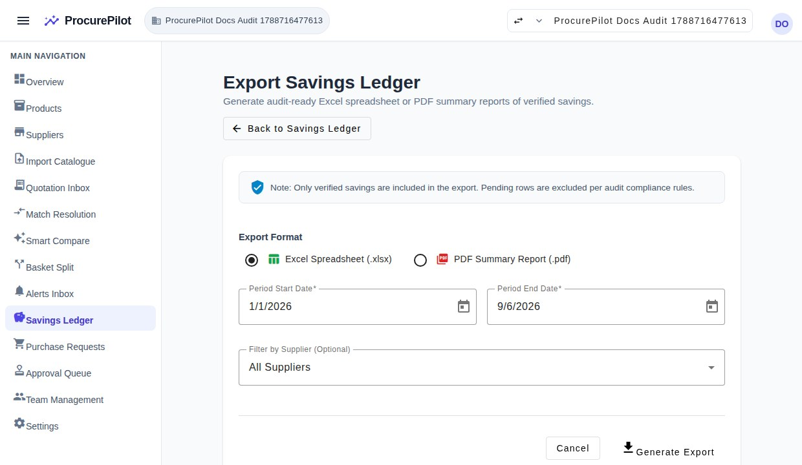

| # | Element | Description |
|---|---------|-------------|
| 1 | **Page title — "Export Savings Ledger"** | Generate audit-ready reports of verified savings, spend by supplier, or commercial alerts. |
| 2 | **Compliance notice** | "Only verified savings are included in the export. Pending rows are excluded per audit compliance rules." |
| 3 | **Export Kind selector** | Choose **Savings Ledger**, **Spend by Supplier**, or **Commercial Alerts Summary**. |
| 4 | **Export Format selector** | Choose **Excel Spreadsheet (.xlsx)**, **CSV Spreadsheet (.csv)**, or **PDF Summary Report (.pdf)**. |
| 5 | **Period Start Date / Period End Date** | Filters the export by recorded date; default to year-to-date. |
| 6 | **Filter by Branch / Supplier** | Optionally restrict the export to an enabled branch or specific supplier. |
| 7 | **Schedule as Weekly Report link** | Pre-populates the Report Schedule form (§23) with the selected kind, format, and filters. |
| 8 | **Generate Export button** | Submits the export job. A progress indicator shows processing status, and a download link appears when complete. |

**Business value:** exports make procurement value portable. Finance, owners, and external advisors can review verified savings and spend intelligence outside the app without losing the evidence discipline that produced the numbers. Export generation is capped at 10,000 rows with a strict 60-second execution budget to protect workspace performance.

---

## 17. Purchase Requests

**Route:** `/requests`

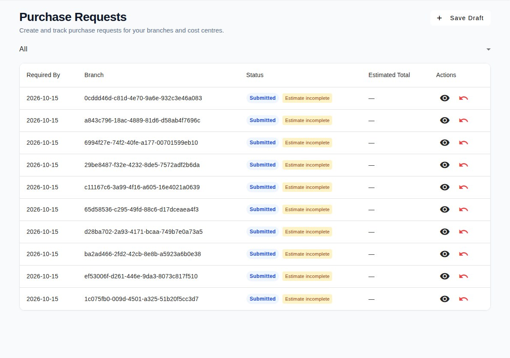

| # | Element | Description |
|---|---------|-------------|
| 1 | **Page title — "Purchase Requests"** | Create and track purchase requests for your branches and cost centres. |
| 2 | **+ Save Draft button** | Opens the new purchase request form. The label currently describes the first action on the next screen rather than the navigation action. |
| 3 | **Status filter** | All, Draft, Submitted, Approved, Rejected, or Withdrawn. |
| 4 | **Request table** | Each row shows the required-by date, branch, status, estimated total, and row actions. Current rows can show an internal branch UUID in the list; the request detail screen resolves the branch and cost-centre names. |
| 5 | **Row actions** | Use the eye icon to open the request. Submitted rows also expose withdrawal where allowed by status. |

**Request lifecycle:**
1. **Draft** — a request is created and can be freely edited. Lines can be added/removed.
2. **Submitted** — the request is sent for approval. It can no longer be edited, but can be withdrawn.
3. **Approved / Rejected** — decided by an approver. Cannot be withdrawn after a decision.
4. **Withdrawn** — the requester pulled back a draft or submitted request before a decision.

**Business value:** purchase requests capture demand before spend happens. That shifts procurement from reactive buying to controlled intake, giving owners visibility by branch, cost centre, need date, and estimated impact.

---

## 18. New Purchase Request

**Route:** `/requests/new` or `/requests/:id`

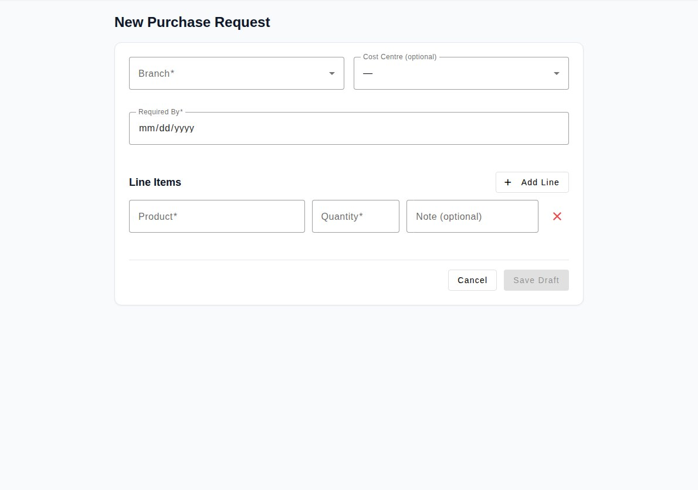

| # | Element | Description |
|---|---------|-------------|
| 1 | **Page title** | Reads "New Purchase Request" when creating a draft and "Edit Purchase Request" when opening an existing draft/submitted request. |
| 2 | **Branch selector** (required) | Select the branch this request is for. Branches are defined in Organisation Settings (section 21) — a request cannot be created until at least one branch exists. Existing requests show the saved branch. |
| 3 | **Cost Centre selector** (optional) | Optionally assign the request to a cost centre for budget tracking. |
| 4 | **Required By date** (required) | The date by which the goods are needed. |
| 5 | **Line Items section** | Each line needs a **Product**, a **Quantity**, and an optional **Note**. |
| 6 | **+ Add Line button** | Adds another line item row. At least one line is required to submit. |
| 7 | **Save Draft / Submit controls** | Saves the request as a draft first; submitted requests become read-only except for status-specific actions such as withdrawal. |

**Current display limitation:** existing submitted requests can show the saved product UUID in the line-item field instead of the product name. The underlying relationship is stored correctly, but the detail display still needs the same friendly-name resolution used elsewhere in the app.

**Approval status (once submitted):** once a request has been routed to an approver, the detail view shows an **Approval** section below the budget status: a status chip (Pending / Approved / Rejected), who it's assigned to, and — once a decision has been made — the approver's comment (if any) and the decision timestamp. This is read-only; only the assigned approver can act on it, from the Approval Queue (section 19).

**Business value:** a structured request preserves the context that is usually lost in chat messages: who needs the item, where it is needed, when it is needed, and what budget or price history should influence the decision.

---

## 19. Approval Queue

**Route:** `/approvals`

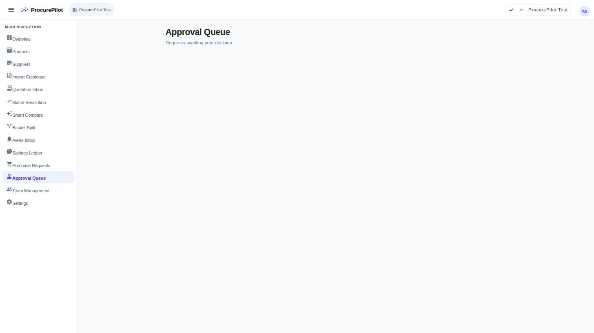

| # | Element | Description |
|---|---------|-------------|
| 1 | **Page title — "Approval Queue"** | Requests awaiting your decision. Only requests routed to you — directly, or via an active delegation (section 21) — based on threshold approval rules appear here. |
| 2 | **Approvals table** | One row per pending request: required-by date, requester, branch, cost centre, estimated total (with an "incomplete estimate" badge when some lines lack pricing), budget status, and line count. |
| 3 | **Budget Status column** | Shows the remaining budget after this request, or an amber "Budget Exceeded" badge with a tooltip and the remaining-budget figure when the request would exceed the applicable budget. Blank when no budget applies. |
| 4 | **Lines column + expand toggle** | Shows the line count; the expand icon reveals a nested table underneath the row with each line's product, quantity, unit price, and note — so you can review the full request without leaving the queue. |
| 5 | **Approve / Reject buttons** | Each row has both actions. Either opens a confirmation dialog with an optional comment field before committing the decision. |
| 6 | **Empty state** | "No requests awaiting your decision" style message when the queue is empty, instead of a blank table. |

**Approve / Reject dialog:**
- A comment is optional on both approve and reject — use it to record why, especially on a rejection.
- Ctrl+Enter (or Cmd+Enter) submits the dialog without reaching for the mouse.
- Confirming removes the request from the queue immediately and shows a snackbar confirmation; the request's own detail page (section 18) then shows the decision, approver's comment, and timestamp.

**Business value:** approval routing reduces cycle time without giving up spend control. The queue surfaces the commercial context needed to decide quickly — branch, amount, budget impact, and full line detail — right where the decision is made, and every decision (with its comment) becomes part of the request's own audit trail.

---

## 20. Team Management

**Route:** `/team` (Owner only)

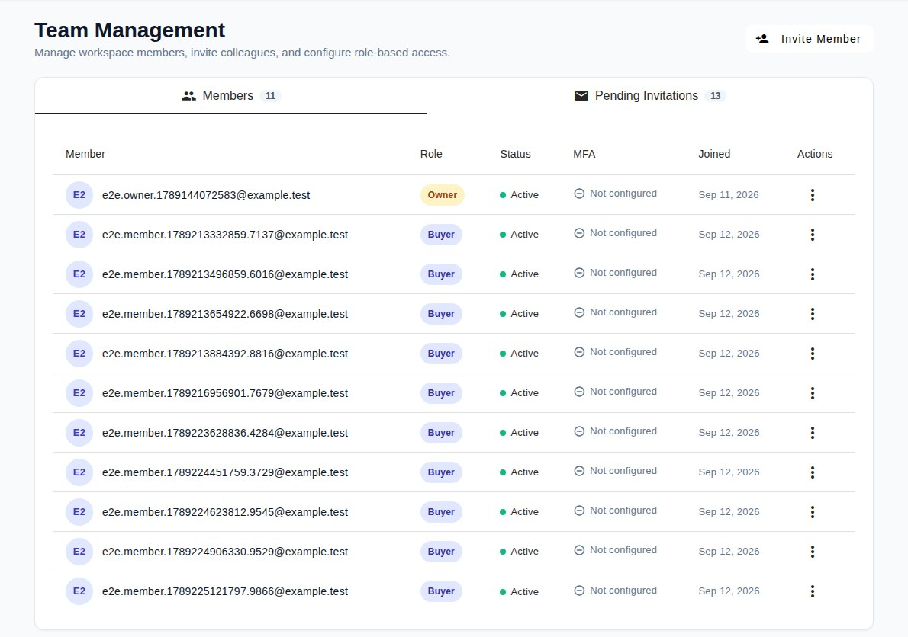

| # | Element | Description |
|---|---------|-------------|
| 1 | **Page title — "Team Management"** | Manage workspace members, invite colleagues, and configure role-based access. |
| 2 | **Invite Member button** | Opens a dialog to invite a colleague by email. You assign them a role (Owner, Buyer, Branch Manager, Approver, Viewer) at invitation time. |
| 3 | **Members tab** | Lists all current members with columns: member, role (colour-coded pill), status (Active/Removed), MFA status, and join date. |
| 4 | **Pending Invitations tab** | Lists all sent invitations with email, assigned role, status (Pending/Accepted/Revoked/Expired), and expiry date. |
| 5 | **Actions menu** (per member) | Options: Change Role, Remove Member. The workspace owner cannot be removed. |

**Invitation flow:**
1. Click **Invite Member** → enter email and select role → send.
2. The invitee receives an email with a link to accept the invitation.
3. They can create a new account or sign in with an existing one.
4. Once accepted, they appear in the Members tab with their assigned role.

**Business value:** Team Management lets the owner delegate procurement work while preserving accountability. Each role creates a clear operating boundary, so buyers can move quickly and sensitive controls stay with the right people.

---

## 21. Organisation Settings

**Route:** `/settings`

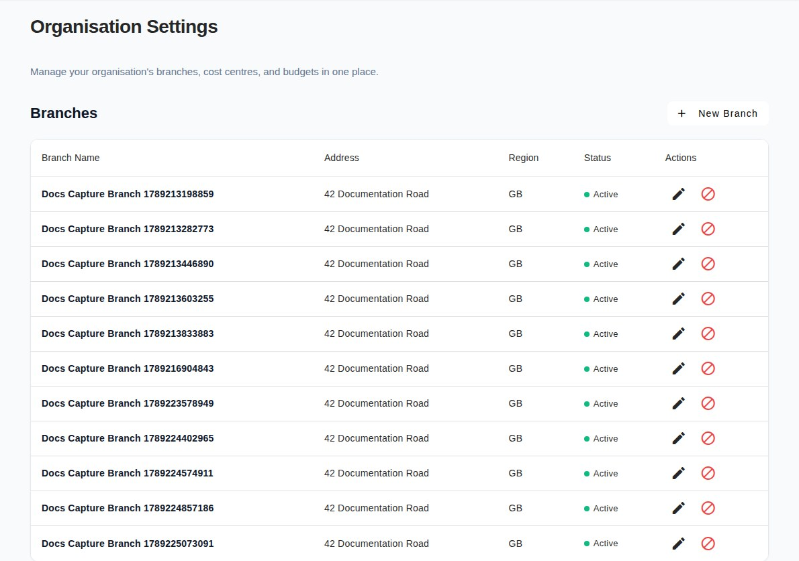

| # | Element | Description |
|---|---------|-------------|
| 1 | **Page title — "Organisation Settings"** | Manage your organisation's branches, cost centres, and budgets in one place. |
| 2 | **Branches section** | Define your physical locations or operational divisions. Click **+ New Branch** to add one — only a name is required; address and region are optional. |
| 3 | **Cost Centres section** | Define cost centres for budget tracking, each with a required **Code** and an optional link to a **Branch**. |
| 4 | **Budgets section** | Define budgets scoped to the whole organisation, a specific branch, or a specific cost centre, with an amount, currency, period (Monthly/Quarterly/Annual), and period start date. |
| 5 | **Approval Delegations section** | Lets an approver delegate their pending decisions to a colleague for a date range (e.g. while on leave). Shows a table of the current member's own delegations: delegate, start date, end date, and a cancel action. **+ New Delegation** opens a dialog to pick the delegate (from a dropdown of workspace members), a start date, and an end date. While a delegation is active, requests that would route to the delegating approver are routed to the delegate instead, and appear in the delegate's own Approval Queue (section 19). |

**Create Cost Centre form:**

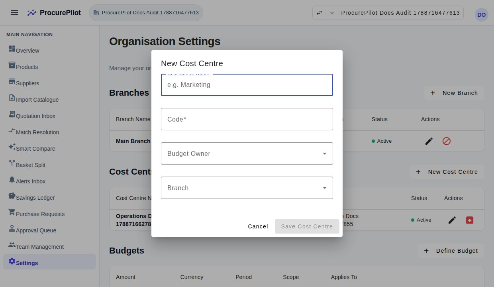

**Define Budget form:**

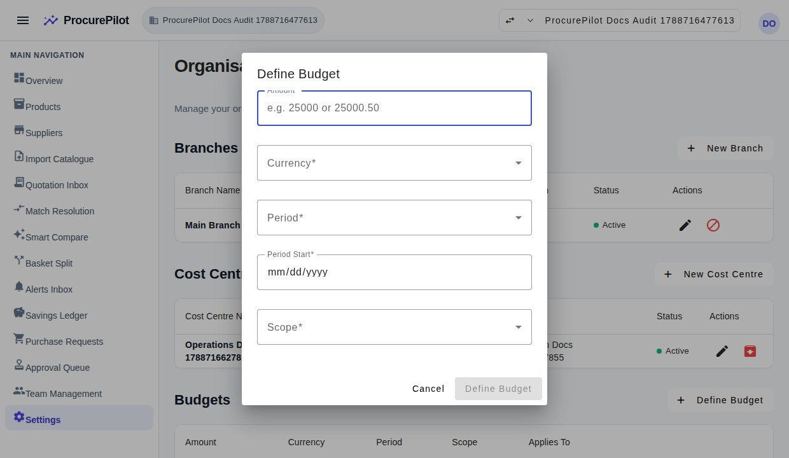

**Why this matters:**
- Purchase requests require a **branch** — this determines who can see and approve the request. A branch must exist before you can create your first request (section 18).
- Cost centres and budgets enable budget-impact visibility on purchase requests.
- When a request's estimated total would exceed a budget, a warning is shown.

**Business value:** organisation settings connect procurement activity to the way the business is managed. Branches, cost centres, and budgets turn isolated purchases into accountable spend by location, department, and financial period.

**Display note:** the Settings screen now resolves branch names in the Branch and Cost Centre tables. See [§36 Known Issues](#36-known-issues) for remaining raw-ID display issues in the Purchase Requests area.

---

## 22. Reports Center

**Route:** `/reports`

The unified workspace hub for generated reporting artifacts and recurring report schedules.

| # | Element | Description |
|---|---------|-------------|
| 1 | **Page title — "Reports Center"** | Browse, filter, and download all generated exports and manage automated reporting schedules. |
| 2 | **Tabs — Artifacts & Schedules** | Toggle between generated report artifacts and recurring report schedules. |
| 3 | **Filter Toolbar** | Filter artifacts by report kind (Savings Ledger, Spend by Supplier, Commercial Alerts Summary) and status (Completed, Queued, Failed, Expired). |
| 4 | **Artifacts List** | Comprehensive table displaying report kind, format pill, creation date, period, row count, and status badge. |
| 5 | **Download Action** | Generates a secure, signed URL (short-lived TTL) for downloading completed Excel, CSV, or PDF artifacts directly from storage. Purged/expired artifacts indicate expiry. |
| 6 | **Operational Deep Links** | Per-kind operational shortcuts allowing instant navigation from artifacts to real actionable contexts: Alerts to the inbox, Savings to the ledger, and Spend to Smart Compare. |

**Print support:** the Reports Center includes a dedicated print stylesheet (`@media print`) that isolates the artifact list and suppresses navigation chrome, filters, and tab headers for clean audit printing.

**Business value:** the Reports Center gives owners and finance one governed place to retrieve procurement evidence after exports are generated. It reduces time spent hunting for spreadsheets, preserves report status and expiry context, and links reports back to the operational screens where follow-up action happens.

---

## 23. Report Schedules & Schedule Form

**Route:** `/reports/schedule-form` (or via **+ New Schedule** in the Reports Center)

Configure automated recurring weekly reports delivered directly to the Reports Center.

| # | Element | Description |
|---|---------|-------------|
| 1 | **Report Kind** | Select **Savings Ledger**, **Spend by Supplier**, or **Commercial Alerts Summary**. Note: Spend by Supplier is available for Excel and CSV only. |
| 2 | **Format** | Choose **Excel Spreadsheet (.xlsx)**, **CSV Spreadsheet (.csv)**, or **PDF Summary Report (.pdf)**. |
| 3 | **Filter by Branch / Supplier** | Optionally scope the recurring report to a specific branch or supplier. |
| 4 | **Delivery Day (Weekday)** | Choose which day of the week (Monday through Sunday) the report automatically generates at midnight in your workspace reporting timezone. |
| 5 | **Locale** | Choose report language (**English** or **Arabic** with full RTL layout and typography). |
| 6 | **Schedule Management** | Active schedules automatically enqueue export jobs weekly. Schedules can be paused or resumed at any time, and survive creator deactivation to preserve operational continuity. |

**Rate limiting & caps:** schedule creation and mutation are rate-limited and capped per member to prevent resource exhaustion. Duplicate schedules matching an existing member/kind/filters configuration return a structured conflict notification.

**Business value:** scheduled reports turn procurement governance into a routine instead of an ad hoc manual task. Weekly exports keep savings, spend, and alert evidence visible to the right people without relying on a buyer to remember to regenerate the same report every week.

---

## 24. Weekly Digest & Digest Settings

**Route:** `/reports/digest-settings`

Personalized weekly intelligence digests assembling key procurement metrics and pending actions into a single actionable overview.

| # | Element | Description |
|---|---------|-------------|
| 1 | **Subscription Controls** | Configure your personal weekly digest subscription, choose delivery channel (**In-App** or **Email**), and select locale. |
| 2 | **Delivery Status & Onboarding** | Displays current delivery state (e.g. "Delivered", or "Email not configured" if workspace SMTP settings are unset). New members receive an active default in-app subscription on invitation acceptance. |
| 3 | **Latest In-App Digest View** | Browse the latest complete weekly digest organized in the standardized five-section hierarchy: **Verified Savings** (hero), **Pending Verifications**, **Pending Approvals**, **Commercial Anomalies**, and **Expiring Validity**. |
| 4 | **Actionable Deep Links** | Every digest section and flagged item contains direct deep links to the responsible review, compare, or approval screen. |
| 5 | **Strictly Advisory** | Digests never execute autonomous purchasing, approvals, or ordering (FR-017). Human authorization is required on the respective surface. |

**Business value:** weekly digests keep commercial attention focused on the highest-value next actions: verified savings, pending approvals, unresolved anomalies, and expiring opportunities. They reduce management blind spots without turning the system into autonomous purchasing.

---

## 25. Roles & Permissions

| Role | Description | Key capabilities |
|------|-------------|-----------------|
| **Owner** | Full administrative access. | Manage billing, team, settings; all buyer capabilities. |
| **Buyer** | Day-to-day procurement operator. | Upload quotations, compare offers, record purchases, manage catalogue, create requests. |
| **Branch Manager** | Location-level requestor. | Create purchase requests, confirm deliveries. |
| **Approver** | Decision authority. | Approve or reject purchase requests within assigned thresholds. |
| **Viewer** | Read-only access. | View dashboards, reports, and savings data. Cannot modify any data. |

**Notes:**
- Roles are assigned at invitation time and can be changed by the Owner from Team Management.
- Role-based visibility is enforced for selected navigation items and route guards.
- Current client-side route guards restrict product/supplier creation, catalogue import, quotation upload, savings outcome/export, and Team Management. Other authenticated pages still rely on backend authorization for unsafe operations.

**Business value:** roles and permissions protect the purchasing process from accidental or unauthorized action. They let the business separate request, buying, approval, administration, and read-only oversight while preserving a clear audit trail of who was allowed to do what.

---

## 26. Ingestion Dashboard

**Route:** `/ingestion`

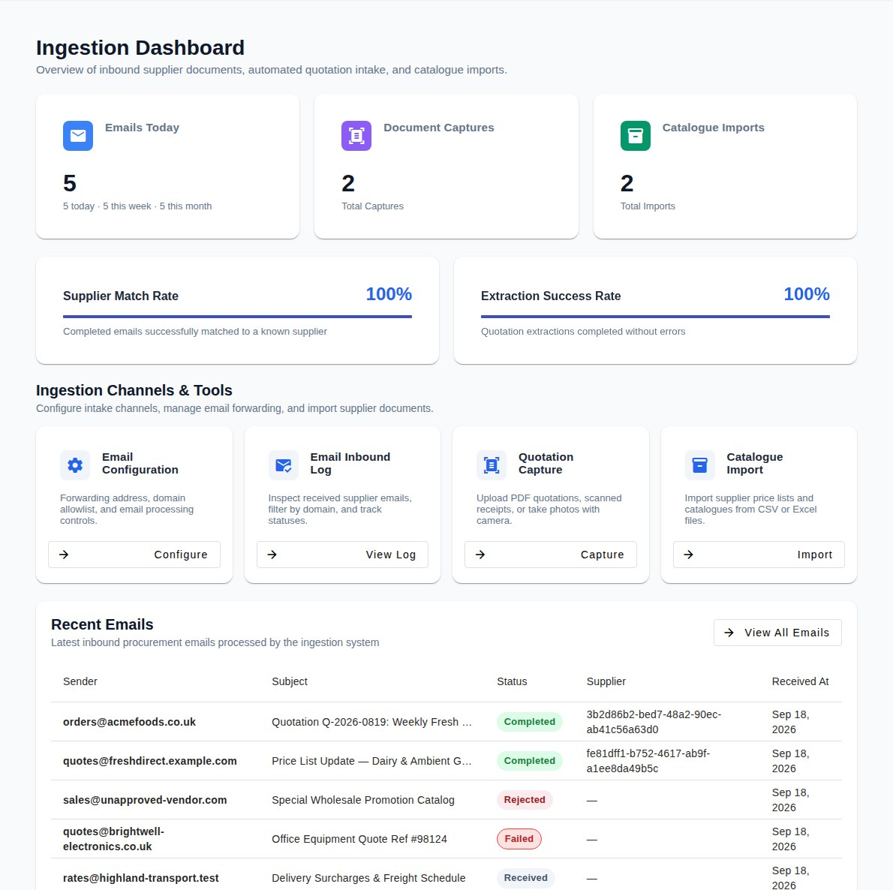

The hub page for automated quotation intake — the landing screen for the three channels documented
in the sections that follow, plus a rolling view of recent activity.

| # | Element | Description |
|---|---------|-------------|
| 1 | **Stat cards** | Three counters: **Emails Today**, **Capture Uploads**, and **Catalogue Imports** — same-day activity across all three inbound channels. |
| 2 | **Rate indicators** | **Supplier Match Rate** and **Extraction Success Rate** — how often inbound documents are automatically linked to a known supplier and successfully parsed into structured line items. |
| 3 | **Channel cards** | One card per inbound channel — **Email Forwarding** (§27), **Email Ingestion Log** (§28), **Capture a Quotation** (§29), and **Catalogue Import** (§30) — each with a direct action button into that screen. |
| 4 | **Recent Emails panel** | A short preview of the most recently received inbound emails, with a **View All** link into the full Email Ingestion Log (§28). Shows an empty state when nothing has arrived yet. |

**Business value:** the dashboard turns "did automated ingestion actually work today" into a single glance, instead of requiring a buyer to open each channel separately to check whether emails are arriving, captures are processing, or catalogue imports are landing cleanly.

---

## 27. Email Forwarding Setup

**Route:** `/ingestion/email-config`

Configure automated inbound email forwarding and domain security to receive and extract supplier quotations directly from your inbox.

| # | Element | Description |
|---|---------|-------------|
| 1 | **Inbound Forwarding Address** | Your workspace's unique ingestion email address. Forward supplier quote emails or PDF attachments to this address to begin automated quotation extraction. |
| 2 | **Copy Address button** | Copies the inbound forwarding email address to your clipboard with one click so you can share it with buyers or set up automated email forwarding rules. |
| 3 | **Email Ingestion Status toggle** | Turn email quotation processing on or off for the workspace. When enabled, incoming emails are processed into quotations; when disabled, incoming emails are rejected. Only workspace owners can turn this on or off (other roles see an informational notice). |
| 4 | **Domain Allowlist input & chips** | Enter approved supplier domains (e.g. `supplier.com`) and click **Add Domain**. Each allowed domain appears as an interactive chip with a remove button. Leave empty to accept inbound emails from all domains. |
| 5 | **Daily Processing Limit counter** | Shows your workspace's daily email volume and processing quota (e.g. "Processed 12 of 100 emails today") to monitor inbound activity and prevent accidental email loops. |
| 6 | **SPF / DKIM Verification badge** | Displays whether strict sender identity verification is active, ensuring inbound messages legitimately originate from the sender's domain. |

**Security and spam controls:** the domain allowlist is a critical abuse-prevention control, not just a technical filter. When empty, emails from any sender domain are accepted; once one or more domains are added, ProcurePilot strictly rejects emails from unapproved domains. This prevents spam, unsolicited marketing messages, or unauthorized external emails from polluting your quotation review queue or consuming your workspace's daily processing allowance.

**Business value:** email forwarding captures supplier quotes where they already arrive, instead of forcing buyers to download and re-upload every attachment manually. The controls reduce missed quotes, speed up comparison readiness, and keep the intake channel clean enough to trust.

---

## 28. Email Ingestion Log

**Route:** `/ingestion/email-log`

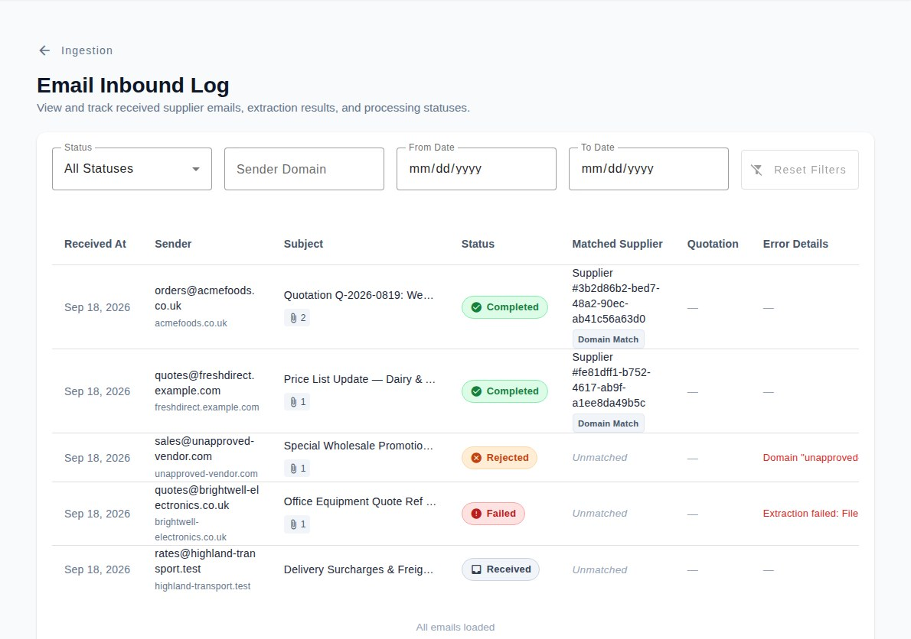

An audit trail of every email received on your workspace's forwarding address, whether or not it
was successfully turned into a quotation.

| # | Element | Description |
|---|---------|-------------|
| 1 | **Status filter** | Filter by processing status (e.g. received, processed, rejected, failed) or view all. |
| 2 | **From Domain filter** | Restrict the log to emails from a specific sender domain. |
| 3 | **Date From / Date To filters** | Restrict the log to a received-date range. |
| 4 | **Reset filters button** | Clears all active filters at once; disabled when no filter is applied. |
| 5 | **Log table** | One row per received email: received time, sender address and domain, subject (with an attachment-count chip when attachments were present), status badge, matched supplier (or "unmatched"), a link to the resulting quotation when one was created, and error details when processing failed. |
| 6 | **Load more** | Cursor-paginated — click to fetch the next page of older emails; shows "no more" once the log is exhausted. |
| 7 | **Empty state** | Shown when no emails have been received yet. |

**Tips:**
- An email rejected for an unapproved sender domain (see §27's domain allowlist) still appears here with a rejected status, so you can confirm the block worked as expected rather than wondering if the email was simply lost.
- The quotation link only appears once an email has been successfully parsed into a quotation — use the error details column to see why a failed email didn't produce one.

**Business value:** the log is what makes an automated, unattended intake channel trustworthy. Without it, a rejected or failed email is invisible; with it, a buyer can confirm every forwarded quote either became a quotation or has a clear, specific reason it didn't.

---

## 29. Capture a Quotation (Photo or Upload)

**Route:** `/ingestion/capture`

Quickly capture paper quotes using your mobile device camera or upload quotation documents from your desktop for automated line-item extraction.

| # | Element | Description |
|---|---------|-------------|
| 1 | **Document Dropzone & Browse Files** | Drag and drop a quotation document into the dropzone or click **Browse Files** to select a file from your computer. Supports PDF, JPEG, PNG, and HEIC files up to 10 MB. |
| 2 | **Take Photo (Capture with Camera)** | On mobile devices or tablets, tap **Take Photo** to open your camera and capture a clear photo of a printed quote, physical invoice, or paper price sheet on the spot. |
| 3 | **Supplier (Optional) selector** | Optionally link the upload to an existing supplier from the dropdown. If left unselected, ProcurePilot's extraction engine will automatically identify the supplier from the document. |
| 4 | **Notes (Optional) field** | Add optional notes or context (such as delivery terms, project codes, or special instructions) to accompany the quotation document. |
| 5 | **Upload & Process button** | Submits the captured file to the ingestion queue. A progress indicator confirms that the document is being uploaded and queued for automated line-item extraction. |
| 6 | **Success confirmation & deep links** | Displays the generated quotation reference (e.g. "Quotation #42 created successfully") with a **View Quotation** button to open the review screen immediately, and a **Capture Another Document** button to submit more quotes. |

**Review workflow:** capturing quotations is available to workspace Owners and Buyers. Once submitted, the captured document enters the automated line-item extraction queue and becomes a standard quotation for review. Line items, prices, and quantities can then be reviewed, adjusted, and authorized in the Quotation Review Queue (§7) and Quotation Review & Authorization screen (§9) exactly like any manually uploaded quotation.

**Business value:** capture lets buyers preserve price evidence at the moment they receive it, even when the source is a paper quote, phone photo, or ad hoc document. That widens the pool of supplier prices available for comparison and reduces the chance that useful market data stays outside the system.

---

## 30. Catalogue Import (Bulk Price List)

**Route:** `/ingestion/catalogue-import`

Bulk-import supplier price lists and catalogues from CSV or Excel spreadsheets into your product matching and comparison catalogue.

| # | Element | Description |
|---|---------|-------------|
| 1 | **Supplier selector (Required)** | Select the supplier whose price list you are importing. Because price lists represent supplier-specific contractual pricing rather than generic products, selecting a supplier is required before choosing or uploading a file. |
| 2 | **Catalogue Dropzone & Browse Files** | Drag and drop a spreadsheet or click **Browse Files** once a supplier is selected. Supports CSV and Excel (`.xlsx`) files up to 25 MB. |
| 3 | **Import Catalogue button** | Uploads the spreadsheet, parses product line items, and runs the automated product matching pipeline against your catalogue. |
| 4 | **Import Results summary** | Displays a stat breakdown upon completion showing Total Rows, Imported Rows, Skipped Rows, and Error Rows, along with an overall summary (e.g. "Successfully imported 142 of 150 rows"). |
| 5 | **Error Details table** | When unparseable rows occur, an expandable table details the exact spreadsheet Row number, Column name, and plain-language Error Description (such as missing product names, unparseable prices, or invalid currency codes). |
| 6 | **Import Another Catalogue button** | Resets the import form so you can import price lists for additional suppliers. |

**Spreadsheet format & partial import resilience:** available to workspace Owners and Buyers. Spreadsheets must include three required columns: product name (accepted headers: `product_name`, `name`, `item`, or `description`), unit price (accepted headers: `unit_price`, `price`, or `rate`; must be a positive number), and currency (accepted headers: `currency` or `curr`; a valid 3-letter currency code such as GBP, USD, or SAR). Optional columns include unit of measure (`unit`, `uom`, or `unit_of_measure`) and minimum order quantity (`qty`, `quantity`, or `moq`). If some rows contain errors, they are listed in the Error Details table and skipped without blocking the rows that succeeded — all valid rows are imported immediately.

**Business value:** catalogue import turns supplier price lists into comparable offer data quickly, instead of waiting for each item to appear on a quotation. Partial import handling keeps good rows moving while making bad rows easy to fix, which improves price coverage without sacrificing data quality.

---

## 31. Reorder Forecasts & Reorder Queue

**Route:** `/forecasting` (Owner or Buyer)

Demand forecasting per product, surfaced as a queue of reorder proposals a buyer reviews and can turn into a draft purchase request.

| # | Element | Description |
|---|---------|-------------|
| 1 | **Page title — "Reorder Forecasts"** | Lists demand-forecast-driven reorder proposals for products with enough purchase and stock history to forecast. |
| 2 | **Refresh forecasts button** | Recomputes forecasts and reorder proposals on demand; shows a snackbar confirmation on completion. |
| 3 | **G3 evidence banner** | A persistent notice stating these forecasts are an R4 preview: connected commercial history has not yet validated the model, so every provisional result must be reviewed by a human before acting on it. |
| 4 | **Draft request details panel** | Two controls used when preparing a request from a proposal: a **Branch** selector (defaults to your first active branch) and a **Required by date** field (defaults to 14 days out). These apply to whichever proposal you next prepare. |
| 5 | **Proposal cards** | One card per product with an open or prepared proposal, showing stock on hand, expected demand, an uncertainty range (low–high), and a suggested reorder quantity. |
| 6 | **Evidence row** | Below the metrics, each card shows the observed history length in days, the forecast's evidence state (Full history / Provisional history / Insufficient evidence), and how long the current forecast stays valid. |
| 7 | **Prepare draft request button** | Turns an open proposal into a draft purchase request using the selected branch and required-by date. Once prepared, the card shows "Draft request is ready in Purchase Requests" instead of the button — the draft still goes through the normal submit/approve workflow. |

**Evidence states:**
- **Full history** — at least 180 days of observed demand history back the forecast.
- **Provisional history** — fewer than 180 days of history; the card carries a warning that it must be reviewed before use.
- **Insufficient evidence** — neither demand nor stock evidence is available yet; no quantity can be suggested and the Prepare button is hidden.

**Tips:**
- A proposal only appears after a matched POS signal has been synchronized and a forecast has been computed — if the list is empty, refreshing forecasts after new sales/stock data has landed is usually the fix.
- **Prepare draft request** never submits or approves anything — it only creates a **Draft** row in Purchase Requests (§17), which still needs to be reviewed, submitted, and approved like any other request.
- This screen, like Basket Split (§12), is Owner/Buyer only — other roles won't see **Reorder Forecasts** in the side navigation.

**Business value:** reorder forecasting turns historical demand into a reviewed, evidence-backed replenishment suggestion instead of a buyer's guess or a stockout after the fact. Because every proposal shows its uncertainty range and evidence state up front, and preparing a request never bypasses approval, the feature speeds up routine restocking without weakening spend control — see `docs/product/function-business-value.md` for how this connects to reduced stockouts and carrying cost.

---

## 32. Supplier Risk Queue & Negotiation Briefs

**Route:** `/supplier-risk`

A workspace-wide queue of the latest evidence-based risk snapshot for every active supplier, extending Supplier IQ (§13) with a comparative view across your whole supplier base.

| # | Element | Description |
|---|---------|-------------|
| 1 | **Page title — "Supplier Risk"** | Scans the latest risk position for every active supplier in one table instead of opening each supplier's scorecard individually. |
| 2 | **Recompute risk button** | Recomputes risk snapshots for all suppliers. Visible to Owner/Buyer only; other roles see a read-only notice instead. |
| 3 | **G3 evidence banner** | States these risk signals are advisory and require human review — they cannot authorise a purchase. |
| 4 | **Risk table** | One row per supplier: name (links to that supplier's scorecard), risk level (Low/Medium/High or "Insufficient data") with the underlying percentage, confidence (Low/Medium/High), evidence state (Ready/Provisional/Insufficient data), top risk driver (spend concentration, price drift, delivery reliability, or single-source exposure), release posture, and validity (Current or Stale, with the exact valid-until date). |
| 5 | **View scorecard action** | Opens that supplier's full Supplier IQ scorecard (§13), where the detailed risk evidence and the option to prepare a negotiation brief live. |
| 6 | **Load more** | Cursor-paginated in pages of 50; click to fetch older/lower-ranked snapshots. |
| 7 | **Empty state** | "No supplier risk snapshots yet" — shown until an owner or buyer computes the first snapshots. |

### Supplier Risk Evidence panel (on the Supplier Scorecard, §13)

The Supplier Scorecard page (`/suppliers/:id/scorecard`) now ends with a **Supplier Risk Evidence** panel — the v2 risk model underneath the Supplier IQ metrics already documented in §13.

| # | Element | Description |
|---|---------|-------------|
| 1 | **Evidence state & posture tags** | Shows the snapshot's evidence state, release posture, and whether it's current or stale, with the exact valid-until date. |
| 2 | **Prepare negotiation brief button** | Visible to Owner/Buyer when a ready or provisional, non-stale v2 snapshot exists. Generates a negotiation brief and navigates straight to it. |
| 3 | **Component evidence table** | One row per risk component (spend concentration, price drift, delivery reliability, single-source exposure): its risk percentage, weight in the overall score, confidence, the sample count and calculation numerator/denominator behind it, any excluded evidence (e.g. cancelled orders, out-of-window records) with counts, and links to the underlying purchase orders or catalogue products. |
| 4 | **Spend by currency table** | Shown only for the concentration component when the supplier is quoted in more than one currency: supplier spend, workspace spend, share, and sample count per currency — so a risk score is never built by silently mixing currencies. |

### Negotiation Brief detail

**Route:** `/negotiation-briefs/:id`

An AI-generated, evidence-backed set of talking points for a risky supplier, reached from the **Prepare negotiation brief** button above.

| # | Element | Description |
|---|---------|-------------|
| 1 | **Back to supplier risk link** | Returns to the Supplier Risk Queue. |
| 2 | **Status tag** | Prepared, Acknowledged, or Dismissed. |
| 3 | **G3 posture notice** | States plainly the brief is advisory and cannot authorise or send a purchase. |
| 4 | **Validity row** | Valid-from and valid-until dates, with a stale/"Expired" tag once the brief is past its validity window. |
| 5 | **Brief items** | A ranked list of talking points — price trajectory, comparable alternatives, service performance, concentration and volume, payment context, or purchase pattern — each with its underlying value, risk percentage, monetary amount (with currency) where relevant, the calculation version used, links to its source evidence (purchase orders, delivery receipts, landed-cost observations, etc.), and a suggested question to ask the supplier. |
| 6 | **Record your review panel** | Visible to Owner/Buyer while the brief is still "Prepared". A required dismissal-reason field, plus **Acknowledge brief** and **Dismiss brief** buttons. Acting records an append-only decision — it never contacts the supplier or changes a purchase itself. |

**Business value:** Supplier Risk and negotiation briefs turn scattered delivery, pricing, and concentration signals into a defensible case a buyer can use in a real supplier conversation. Because every driver, score, and talking point cites its source evidence, and every action taken on a brief is logged rather than automated, buyers get real leverage in negotiation without the system ever contacting a supplier or committing spend on its own — see `docs/product/function-business-value.md` for the wider risk-reduction rationale.

---

## 33. Procurement Analyst

**Route:** `/analyst` or `/analyst/:conversationId`

A grounded, cited question-and-answer assistant over your own tenant data — spend and savings, supplier performance and risk, orders and quotations, and reorder forecasts.

| # | Element | Description |
|---|---------|-------------|
| 1 | **Page title — "Procurement Analyst"** | States plainly the assistant only answers from your own data and shows its calculation and sources with every answer. |
| 2 | **Question History button** | Opens the Question History screen (below). |
| 3 | **G3 evidence banner** | Confirms the analyst never places, drafts, or sends a purchase — advisory only, reviewed by a human. |
| 4 | **Ask a question field** | A single-line text input. Submitting sends the question to the analyst; the field clears once an answer is added to the thread. |
| 5 | **Conversation thread** | Each turn shows your question and the analyst's answer. A turn with no citations and no calculation is a refusal (the analyst declined to answer, e.g. because it couldn't find grounding data) and is styled distinctly from an answered turn. |
| 6 | **Show calculation panel** | An expandable panel on turns that computed a number: the exact formula used and its inputs, so the figure can be checked rather than taken on faith. |
| 7 | **Sources list** | Every citation backing the answer, labelled by kind — purchase order, quotation line, landed cost, saving record, supplier scorecard, delivery receipt, or reorder proposal. |
| 8 | **Next-step link** | Some answers (supplier performance/risk, reorder forecasts, spend/savings) include a deep link straight to the relevant screen — the supplier's negotiation brief, the Reorder Queue, or a report — so an answer can be acted on immediately. |
| 9 | **Empty state** | "No questions yet" with example topics (spend and savings, supplier performance and risk, orders and quotations, reorder forecasts) to prompt a first question. |

**Follow-up questions:** asking a second question in the same browser session continues the same conversation — the analyst resolves context from the immediately preceding turn on the server, not from anything held in the browser. Opening the page via a history entry reopens that specific conversation by its ID in the route.

### Question History

**Route:** `/analyst/history`

| # | Element | Description |
|---|---------|-------------|
| 1 | **Page title — "Question History"** | Lists every past conversation with the analyst. |
| 2 | **New Conversation button** | Returns to `/analyst` to start a fresh conversation. |
| 3 | **History cards** | One card per conversation: the date it started, how many turns it contains, and the first question asked. Click anywhere on a card (or press Enter) to reopen that conversation. |
| 4 | **Load More button** | Cursor-paginated in pages of 50. |
| 5 | **Empty state** | "No past conversations found" when nothing has been asked yet. |

**Business value:** the analyst collapses the time it takes to answer a commercial question — "how much have we saved with Supplier X this quarter", "which suppliers are our biggest concentration risk" — from a manual spreadsheet exercise into a cited, checkable answer with a direct link to act on it. Because every answer shows its formula and sources (or explicitly refuses rather than guessing), it extends trust rather than spending it — see `docs/product/function-business-value.md` for the broader case.

---

## 34. RFQ Sourcing & Response Comparison

**Route:** `/rfq/create` (Owner or Buyer) — reached via the **Create RFQ** button on RFQ History (below), or by navigating directly.

Sends a structured request for quotation to one or more suppliers by email. Replies are captured and matched automatically; a buyer then compares them side by side and turns a chosen response into a draft purchase request. The screen uses the same Material form components, and is translated into Arabic, like the rest of the app.

| # | Element | Description |
|---|---------|-------------|
| 1 | **Items section** | One row per line: a **Product** dropdown (populated from your catalogue, showing product name and variant — not a raw ID) and a **Quantity** field. **Add Line** adds another row; **Remove** deletes one (at least one line must remain). |
| 2 | **Suppliers dropdown** | A multi-select populated with your active suppliers, showing supplier name. Only suppliers that have a contact email on file (§5) appear in the list — a supplier without one simply isn't selectable here. |
| 3 | **Needed By Date field** | A date picker for the date the buyer needs the goods by. |
| 4 | **Terms and Conditions field** | Optional free text included with the RFQ (e.g. delivery or payment terms suppliers should quote against). |
| 5 | **Save Draft button** | Creates the RFQ in `draft` status. Once created, the button disables — the draft is saved once per visit to this form. |
| 6 | **Rejected Suppliers list** | Appears only if the backend still excluded a selected supplier from the RFQ (for example, its contact email was removed between when the page loaded and when you saved). Since the dropdown already limits selection to suppliers with a contact email on file, this list is expected to stay empty in normal use. |
| 7 | **Send RFQ button** | Appears once the draft is saved. Dispatches the RFQ by email to every recipient still pending, and shows the current RFQ status ("draft" or "sent"). |

### RFQ History

**Route:** `/rfq/history` (Owner or Buyer)

| # | Element | Description |
|---|---------|-------------|
| 1 | **Page title — "RFQ History"** | Tracks every request for quotation you've created. |
| 2 | **Create RFQ button** | Top-right of the header. Navigates to `/rfq/create` (above) — this is the app's navigation entry point into Create RFQ. |
| 3 | **RFQ table** | One row per RFQ: status (Draft/Sent/Responded/Expired/Converted), needed-by date, sent date, recipient count, and response count. |
| 4 | **Row click** | Opens the RFQ. A `Converted` row opens the purchase request it produced (§18); any other status opens the Compare RFQ Responses screen (below). |

### Compare RFQ Responses

**Route:** `/rfq/compare/:id` (Owner or Buyer)

| # | Element | Description |
|---|---------|-------------|
| 1 | **Page title — "RFQ Responses"** | Compares every captured supplier response to this RFQ side by side. |
| 2 | **Deliver to Branch / Required By controls** | Set once and used for whichever response you prepare into a request. |
| 3 | **Response cards** | One card per supplier response: supplier name, submitted date, and a line table (product, quantity, unit price, total value). A line whose product hasn't been matched yet to a catalogue product shows a **Pending Match** badge instead of a price line. |
| 4 | **Prepare Request button** | Creates a draft purchase request priced from this response's actual quoted prices (not a landed-cost estimate) and marks the RFQ `Converted`. Disabled while any line on the response is still a pending match — a request is only ever prepared from a fully-priced response. The confirmation includes a **View Request** action that jumps straight to the new draft. |
| 5 | **No responses state** | Shown until at least one supplier reply has been captured and matched. |

**Guarded automatic preparation:** a tenant owner can configure an auto-preparation guardrail (maximum order value, optional supplier/category allowlist, minimum response count, maximum price variance) via the API; when every condition is met and one response is unambiguously the lowest-priced eligible one, ProcurePilot runs the same prepare-request step automatically and the RFQ simply appears here already `Converted` — there is no separate confirmation step for it. **There is currently no settings screen for configuring this guardrail** — it exists only as a backend capability (owner-only), so until a UI ships, turning it on needs API/engineering support. Whether prepared manually or automatically, every path still produces an ordinary draft purchase request that goes through the unchanged approval workflow — nothing in this release creates, submits, or sends a purchase order to a supplier.

**Business value:** automated RFQ sourcing collapses the slowest part of competitive sourcing — chasing multiple suppliers by email and re-keying their replies into a comparison — into an automatic capture-and-compare step, while keeping the final purchasing decision with a human on every path, guarded or manual. See `docs/product/function-business-value.md` for how faster, evidence-backed sourcing rounds translate into negotiating leverage and cycle-time savings.

---

## 35. FAQ

**Q: Can I edit a verified saving?**
A: No. Verified savings are immutable. If a correction is needed, a new adjustment record is created.

**Q: Why is extraction confidence low?**
A: Usually because the document is blurry, handwritten, or uses an unfamiliar layout. Your corrections improve future extraction accuracy.

**Q: What happens if a supplier is blocked?**
A: Smart Compare flags offers from blocked suppliers, and purchasing requires an exception justification.

**Q: Can I use ProcurePilot in Arabic?**
A: Yes. Click the account menu (top right) and select "Arabic". The entire layout switches to RTL automatically, including navigation, forms, and data tables.

**Q: What file formats can I upload for quotation extraction?**
A: PDF, PNG, JPEG, TIFF, CSV, XLS, and XLSX — up to 25 MB per file. Six sample files covering every format are available directly on the upload screen if you want to try the pipeline first.

**Q: How does pack normalisation work?**
A: Each product has a base unit (kg, litre, piece, etc.). When you define the pack count and unit size, ProcurePilot calculates the normalised base quantity live. All supplier prices are converted to this normalised unit for true like-for-like comparison.

**Q: Is the "Match Score" on a candidate product a real confidence percentage?**
A: Not yet. It's a heuristic score used to rank and route candidates — the app is explicit about this on the Match Resolution screen. It is not a calibrated statistical probability, so don't read a 65% match score as "65% likely correct"; it's the best available ranking of the candidates found.

**Q: Can I switch between multiple workspaces?**
A: Yes. If you belong to multiple workspaces, use the workspace switcher in the top bar to switch. Each workspace has its own data, members, and settings — completely isolated.

**Q: Who can approve purchase requests?**
A: Users with the Approver or Owner role. Approval routing is based on configurable thresholds — requests above a certain amount may require a higher-level approver. If the assigned approver has set up an active delegation (section 21), the request routes to the delegate instead, and the decision is made from the delegate's own Approval Queue.

**Q: What happens if an email is forwarded from a domain not on the allowlist?**
A: If you have configured a domain allowlist, any incoming email sent from an unapproved domain is rejected. It will not be processed into a quotation or added to your review queue, protecting your workspace from spam and unverified submissions.

**Q: What happens if some rows in my catalogue spreadsheet contain errors?**
A: ProcurePilot uses partial import resilience. All valid rows are imported into the supplier catalogue immediately, while rows with errors (such as missing product names or invalid currency codes) are reported in the expandable Error Details table with their row number and reason so you can fix and re-import them.

**Q: Why didn't my RFQ auto-prepare a request through the guardrail?**
A: Every condition has to hold at once: the RFQ still open, at least the configured minimum number of responses received, every line on that response matched to a catalogue product, its currency matching the guardrail's currency exactly, its supplier (and category, if configured) allowed, its total under the configured maximum, its price within the configured variance of your recent purchase history for that product, and it must be the single lowest-priced eligible response — a tie never fires. If even one condition fails, the response is simply left for you to prepare manually from RFQ Responses (§34). There's also no settings screen yet for configuring the guardrail itself — see [§36 Known Issues](#36-known-issues).

**Q: What happens if a supplier never replies to an RFQ?**
A: Nothing breaks. The RFQ stays in `Sent` status with a response count lower than its recipient count, and you can still compare and prepare a request from whichever suppliers do reply. A supplier that never responds simply never produces a card on the Compare RFQ Responses screen (§34).

---

## 36. Known Issues

Originally found during the 6 Sep 2026 documentation pass; re-checked and updated 12 Sep 2026 against current `main`; extended 25 Sep 2026 to cover R4.0–R4.3; re-checked 26 Sep 2026 against Create RFQ's Material/i18n rewrite (PR #29).

| # | Where | Issue |
|---|-------|-------|
| 1 | Purchase Requests (§17) | Submitted request rows can display the raw branch UUID in the Branch column instead of the branch name. Still present as of 12 Sep 2026. |
| 2 | Purchase Request detail (§18) | Existing request line items can display the saved product UUID rather than the product's catalogue name. The linked product still exists and the relationship is stored correctly. Still present as of 12 Sep 2026. |
| 3 | Quotation review detail (§9) | The CSV sample upload completed and opened the review screen, but the header fields extracted from the CSV sample left some optional quotation fields blank. The PDF/image sample path depends on external extraction-provider credentials; during the original pass Bedrock fell back because AWS SSO was expired, while CSV extraction still completed successfully. Not re-verified in the 12 Sep pass. |
| 4 | RFQ auto-preparation guardrails (§34) | Configuring the guardrail (max order value, allowlists, minimum responses, price variance) is API-only and owner-restricted — there is no settings screen for it yet. Found 25 Sep 2026, still present as of 26 Sep 2026. |

**Resolved since the original pass:** the Approval Queue (§19) previously rendered only its title/subtitle with no request cards. It is now fully functional — pending requests, budget status, expandable line detail, and an approve/reject dialog with an optional comment — and an approval-delegation management UI (§21) has been added. **Also resolved 26 Sep 2026:** Create RFQ (§34) previously used plain HTML controls with no Material styling, no Arabic translation, a supplier picker hardcoded to placeholder `sup-1`/`sup-2` options, and no navigation entry point (reachable only by typing `/rfq/create`). It now uses full Material form components, is translated into English and Arabic, populates real suppliers and products from your workspace data, and is reachable from a **Create RFQ** button on RFQ History.

If you hit any of these, it's not something wrong with your setup — flag it to the product team.

---

## Getting Help

- In-app feedback: **Account menu → Send Feedback**.
- Email: support@procurepilot.example.com.
- Response target: within 1 business day for paid plans.
