# ProcurePilot User Flows

> Navigation paths for every user-facing page, with journey visualisations.
> Last updated: 25 Sep 2026.
>
> Covers the web app only. The mobile app uses named routes rather than URLs; see
> [ProcurePilot Mobile App User Documentation](mobile-app-user-documentation.md) for its screens
> and navigation.

---

## Access and Workspace Setup

- `/auth/sign-in` -> sign in -> `/home`
- `/auth/sign-in` -> **Forgot password?** -> `/auth/password-reset` -> email reset link
- `/auth/sign-in` -> **Create workspace** -> `/onboarding/signup` -> invitation token + workspace details -> `/onboarding/plan` -> `/home`
- `/onboarding/accept-invitation?token=...` -> accept member invitation -> `/home`
- Guarded page while signed out -> `/auth/sign-in?returnUrl=...` -> original page after sign-in

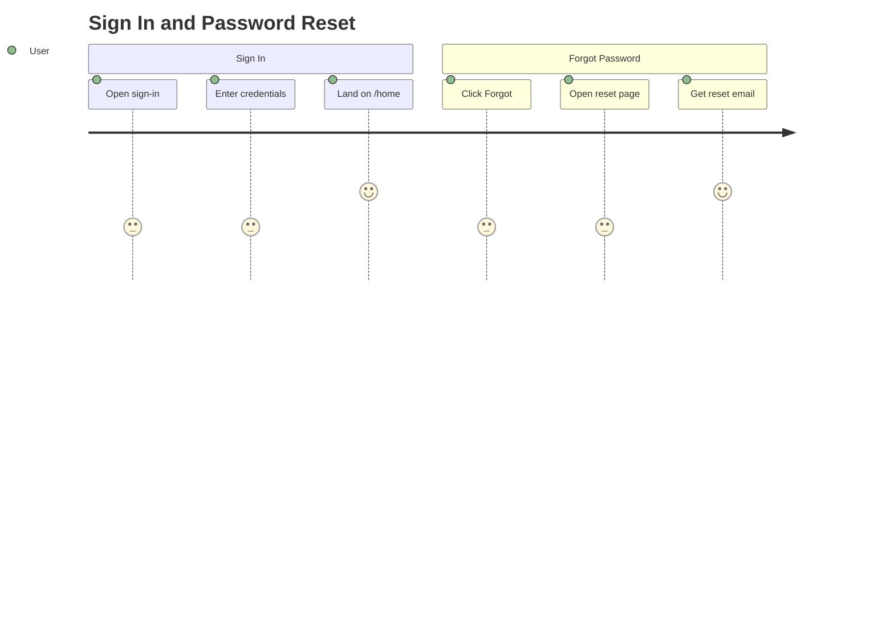

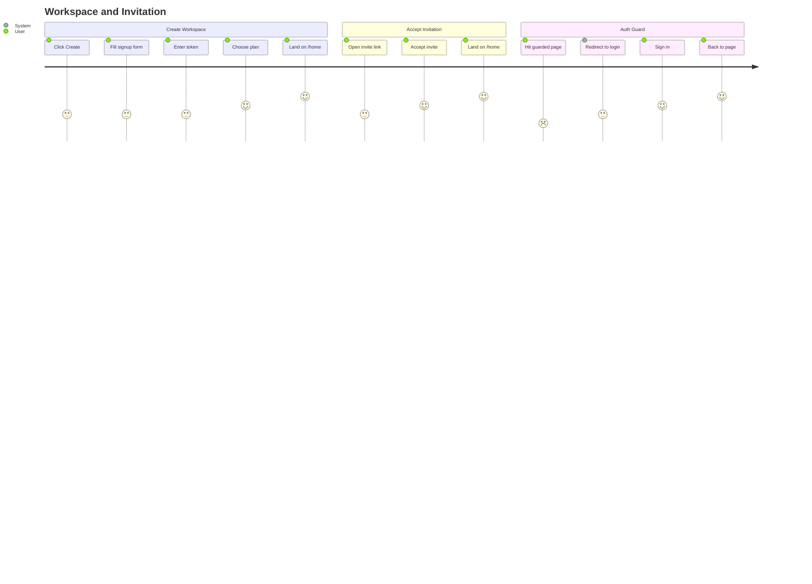

## Catalogue and Supplier Setup

- `/home` -> **Products** -> `/products` -> **New Product** -> `/products/new` -> save -> `/products/:id`
- `/home` -> **Products** -> `/products` -> row edit -> `/products/:id`
- `/home` -> **Products** -> `/products` -> **Import Products** -> `/import?kind=products` -> upload CSV -> preview -> commit -> `/products`
- `/home` -> **Suppliers** -> `/suppliers` -> **New Supplier** -> `/suppliers/new` -> save -> `/suppliers/:id`
- `/home` -> **Suppliers** -> `/suppliers` -> row edit -> `/suppliers/:id`
- `/home` -> **Suppliers** -> `/suppliers` -> **Import Suppliers** -> `/import?kind=suppliers` -> upload CSV -> preview -> commit -> `/suppliers`
- `/home` -> **Import Catalogue** -> `/import` -> choose Products or Suppliers -> upload CSV -> preview -> commit

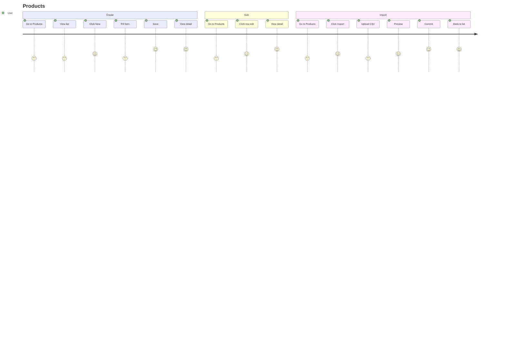

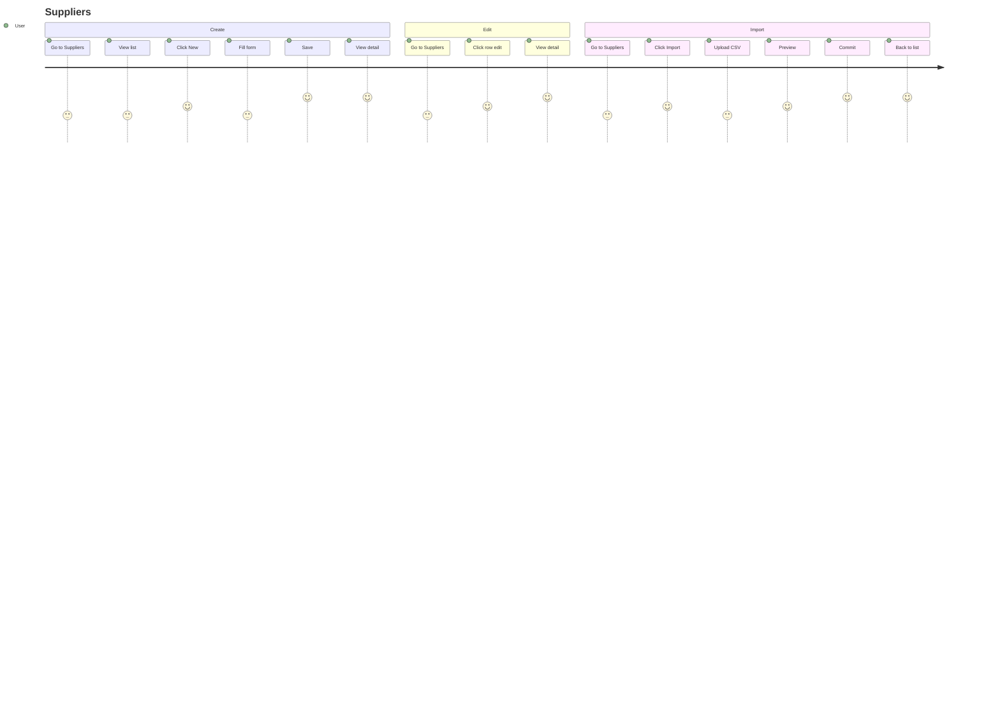

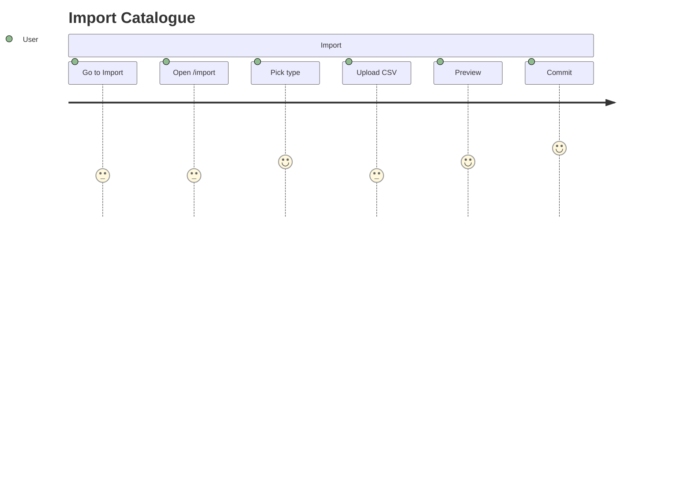

## Quotation to Trusted Offer

- `/home` -> **Quotation Inbox** -> `/quotations` -> **Upload Quotation** -> `/quotations/upload` -> select file or sample -> extraction complete -> `/quotations/:id/review`
- `/quotations` -> search/filter/sort -> **Review & Authorize** -> `/quotations/:id/review`
- `/quotations/:id/review` -> inspect source evidence + fields + lines -> save corrections -> confirm and authorize
- `/quotations/:id/review` -> retry extraction, export CSV, archive, or create re-quote
- `/quotations/:id` redirects to `/quotations/:id/review`

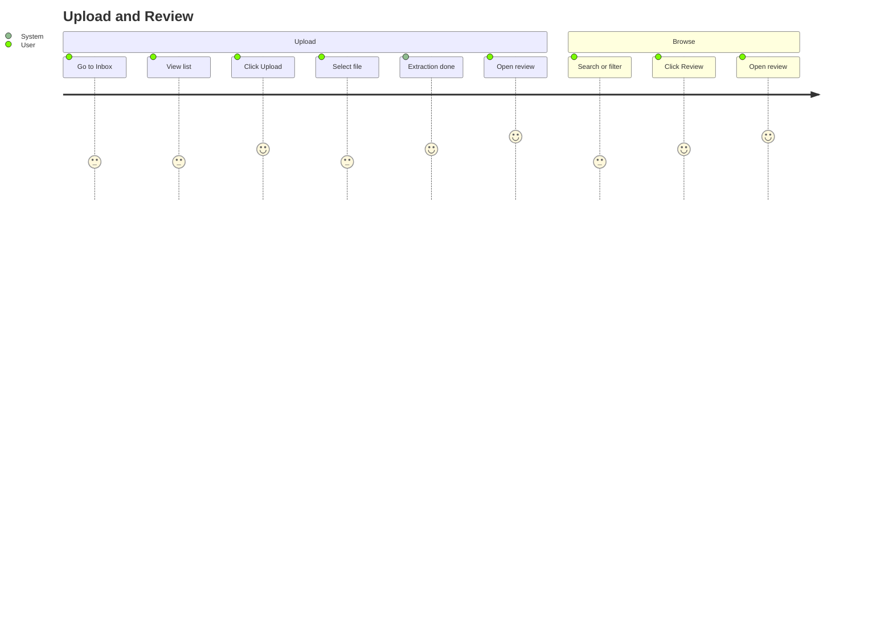

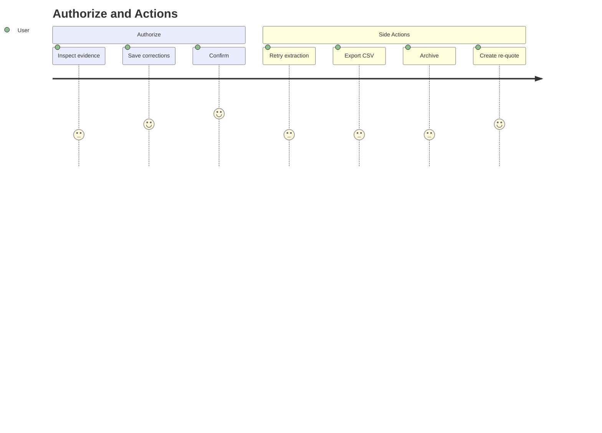

> `/quotations/:id` redirects to `/quotations/:id/review`

## Matching, Comparison, and Savings

- `/home` -> **Match Resolution** -> `/matching` -> search/filter/sort -> **Resolve Match** -> `/matching/:id` -> choose outcome -> confirm
- `/matching/tasks/:id` redirects to `/matching/:id`
- `/home` -> **Smart Compare** -> `/offers/compare` -> select product + quantity -> compare landed costs -> **Record Purchase** -> `/savings/outcome-capture`
- `/offers/compare/:id` opens Smart Compare with a product preselected; `/compare` and `/compare/:id` are aliases
- `/home` -> **Smart Compare** -> `/offers/product-intelligence` -> select product/supplier/time window -> inspect historical prices
- `/offers/product-intelligence/:id` opens Product Price Intelligence with a product preselected
- `/home` -> **Basket Split** -> `/offers/basket-split` -> choose two suppliers + basket lines -> optimise -> `/offers/basket-split/:id`
- `/home` -> **Alerts Inbox** -> `/alerts` -> open alert action -> Smart Compare, supplier detail, or Product Price Intelligence
- `/home` -> **Savings Ledger** -> `/savings` -> **Record Purchase Outcome** -> `/savings/outcome-capture` -> compute saving -> `/savings/:id/evidence`
- `/savings` -> **View Evidence** -> `/savings/:id/evidence`; `/savings/:id` is an alias
- `/savings` -> **Export Savings** -> `/savings/export` -> generate export -> `/savings/export/:id`

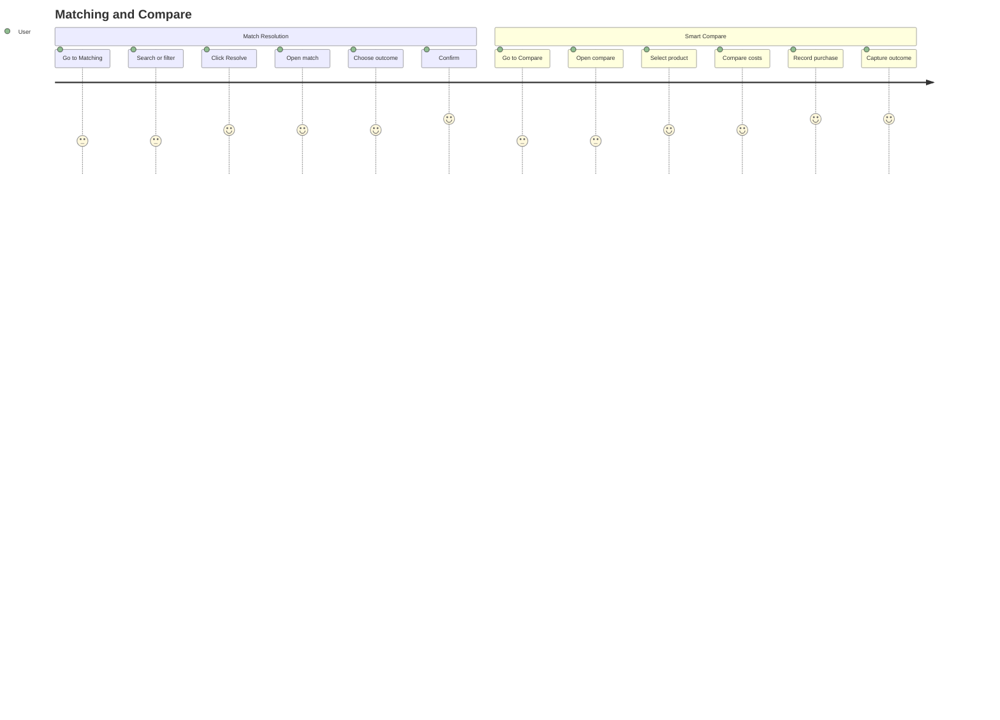

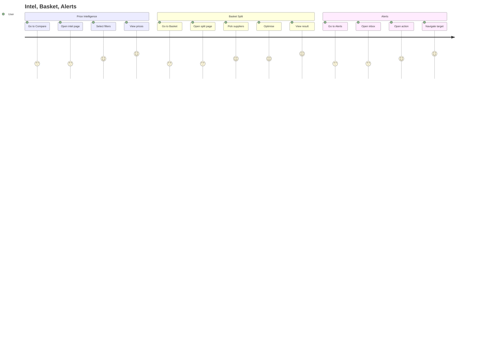

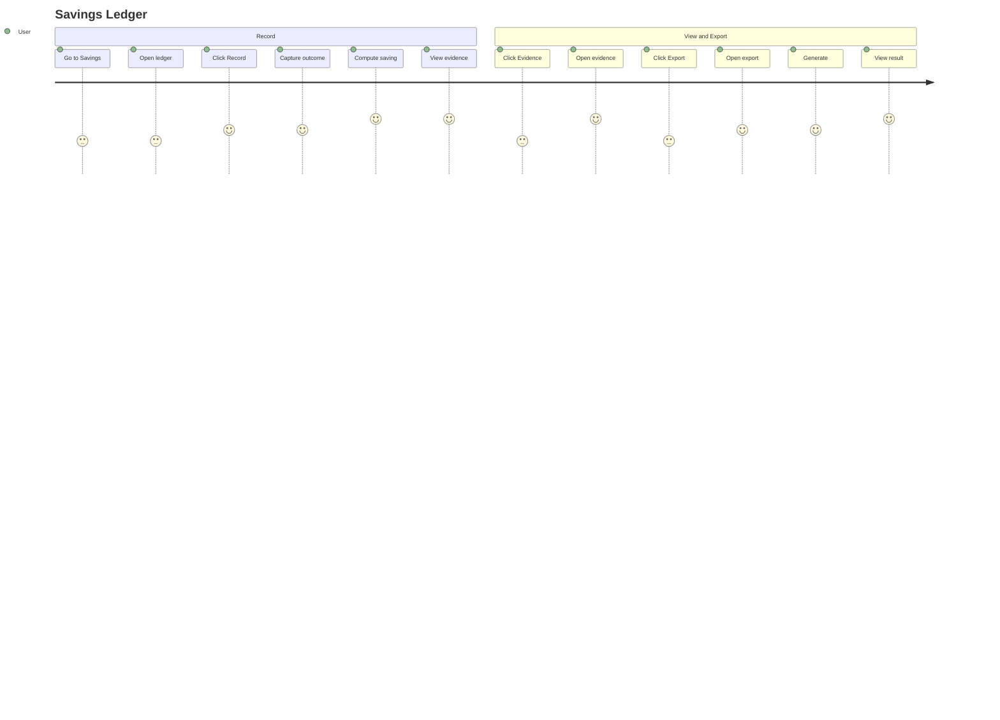

> **Redirects:** `/matching/tasks/:id` -> `/matching/:id` | `/offers/compare/:id` -> `/offers/compare` (preselected; `/compare` alias) | `/offers/product-intelligence/:id` -> `/offers/product-intelligence` (preselected) | `/savings/:id` -> `/savings/:id/evidence`

## Requests, Approvals, and Administration

- `/home` -> **Purchase Requests** -> `/requests` -> **Save Draft** -> `/requests/new` -> save draft -> `/requests/:id`
- `/requests/:id` -> submit, withdraw, or return to the queue depending on status
- `/requests/:id` (once routed to an approver) -> view Approval status section -> decision, comment, and timestamp appear once decided
- `/home` -> **Approval Queue** -> `/approvals` -> expand a row's lines -> **Approve** or **Reject** -> confirm (with optional comment) -> back to queue
- `/home` -> **Settings** -> `/settings` -> **+ New Delegation** -> pick delegate + date range -> save -> delegated requests route to the delegate's own Approval Queue
- `/home` -> **Team Management** -> `/team` -> invite member -> pending invitation -> accept invitation flow
- `/home` -> **Settings** -> `/settings` -> manage branches, cost centres, budgets, and approval delegations
- Unknown routes redirect to `/`, then to `/home` for signed-in users.

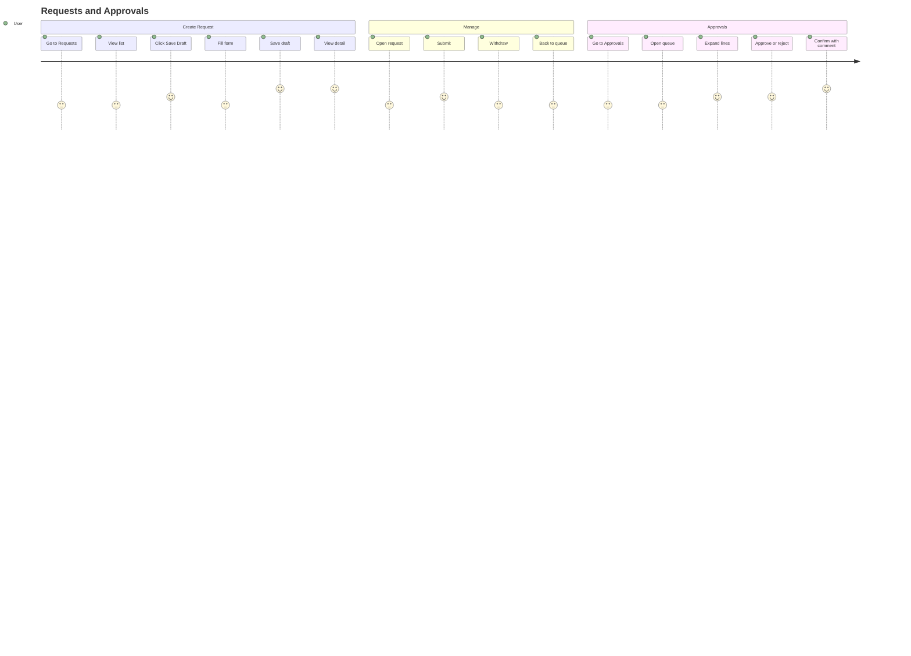

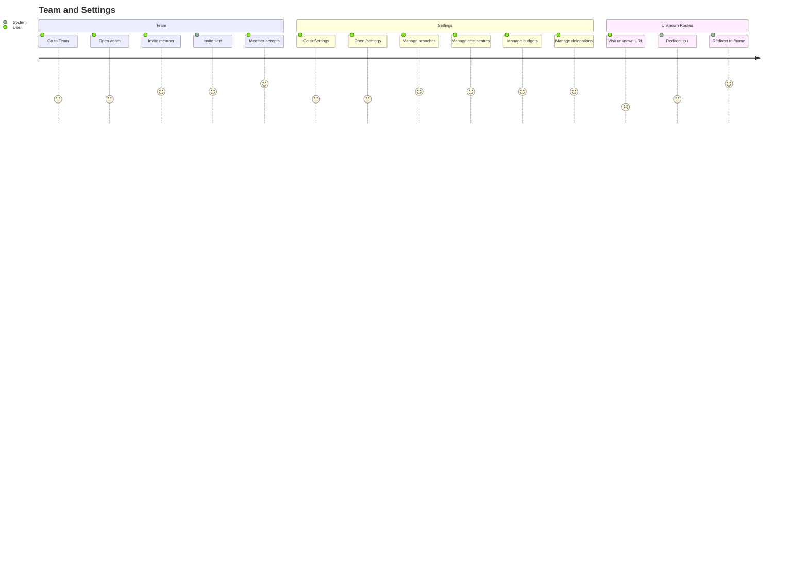

---

## Predictive Procurement and Sourcing

- `/home` -> **Reorder Forecasts** -> `/forecasting` -> pick branch + required-by date -> **Prepare draft request** -> draft appears in `/requests`
- `/home` -> **Supplier Risk** -> `/supplier-risk` -> **View scorecard** -> `/suppliers/:id/scorecard` -> **Prepare negotiation brief** -> `/negotiation-briefs/:id` -> acknowledge or dismiss
- `/home` -> **Procurement Analyst** -> `/analyst` -> ask a question -> follow a next-step link, or **Question History** -> `/analyst/history` -> reopen a conversation -> `/analyst/:conversationId`
- `/rfq/create` -> add lines + pick suppliers -> **Save Draft** -> **Send RFQ** -> supplier replies captured automatically (not yet linked from navigation — see [Known Issues](user-documentation.md#36-known-issues))
- `/home` -> **RFQ History** -> `/rfq/history` -> open a row -> `/rfq/compare/:id` -> **Prepare Request** -> draft appears in `/requests`; a `Converted` row instead opens `/requests/:id` directly

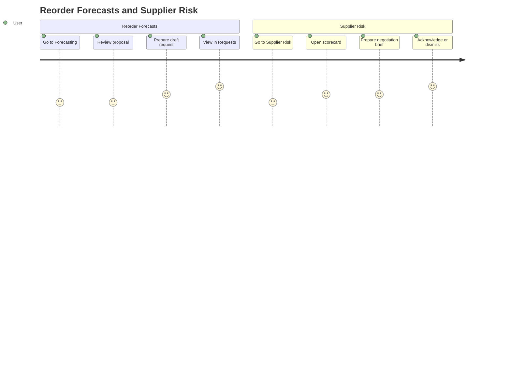

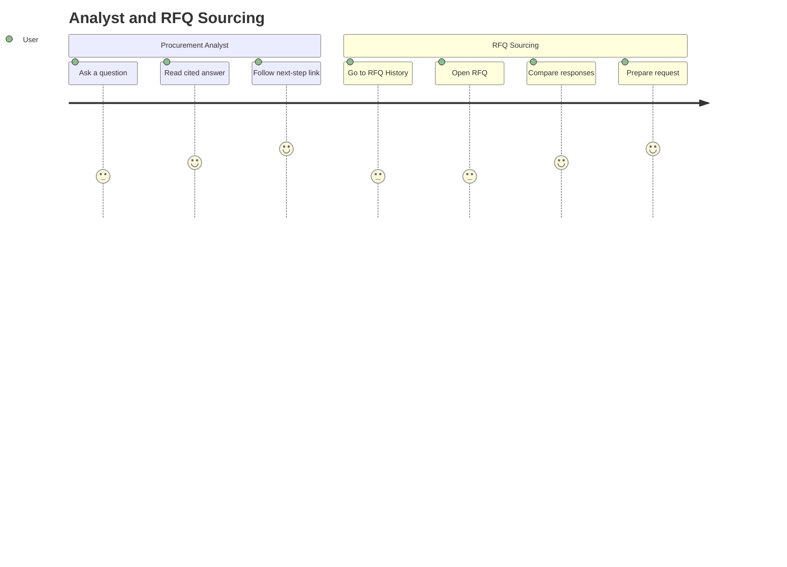

> **Note:** `/rfq/create` has no navigation entry point anywhere in the app shell as of this
> writing — it is reachable only by URL. Every other route above is reachable from the side
> navigation under `/home`.

---

For screen-by-screen details and screenshots, see [ProcurePilot User Documentation](user-documentation.md).
